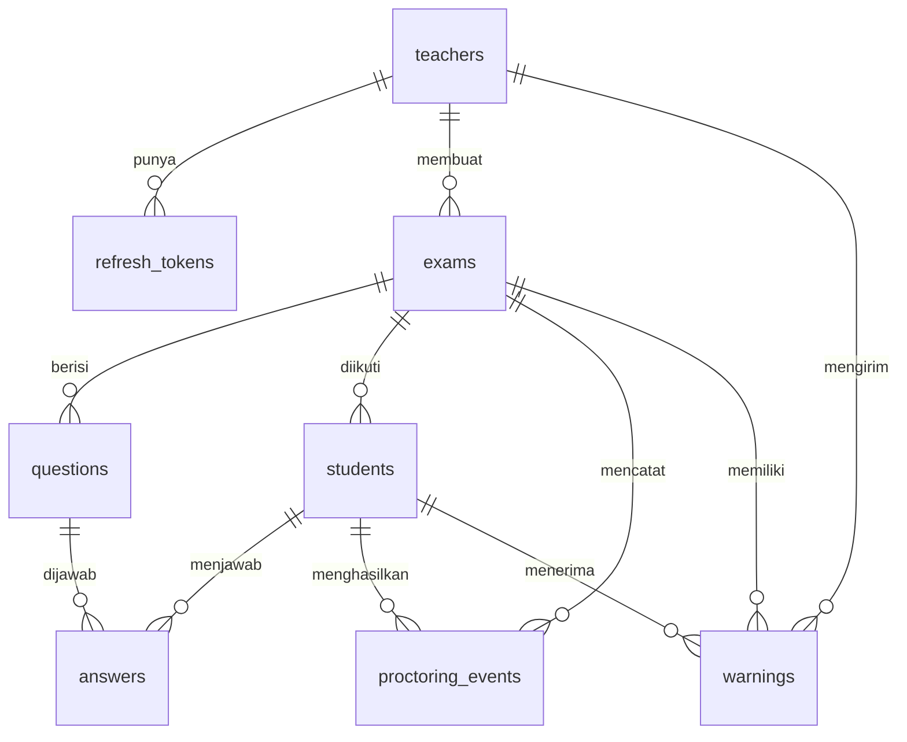

# Database Schema — LockIt

> Dokumen ini mendefinisikan **semua tabel dan field** yang digunakan di database LockIt (PostgreSQL).

---

## Daftar Isi

1. [Ringkasan Tabel](#1-ringkasan-tabel)
2. [Diagram Hubungan Antar Tabel](#2-diagram-hubungan-antar-tabel)
3. [Detail Setiap Tabel](#3-detail-setiap-tabel)
4. [Index yang Disarankan](#4-index-yang-disarankan)
5. [Prisma Schema](#5-prisma-schema)

---

## 1. Ringkasan Tabel

| No | Nama Tabel | Fungsi | Jumlah Field |
|---|---|---|---|
| 1 | `teachers` | Data akun guru/dosen | 6 |
| 2 | `refresh_tokens` | Token untuk perpanjang sesi login guru | 6 |
| 3 | `exams` | Data ujian yang dibuat guru | 12 |
| 4 | `questions` | Soal-soal dalam ujian | 7 |
| 5 | `students` | Data peserta yang join ujian | 12 |
| 6 | `answers` | Jawaban peserta per soal | 7 |
| 7 | `proctoring_events` | Catatan pelanggaran/aktivitas peserta | 7 |
| 8 | `warnings` | Peringatan yang dikirim guru ke peserta | 7 |

**Total: 8 tabel, 64 field**

---

## 2. Diagram Hubungan Antar Tabel



**Cara baca:**
- `||--o{` artinya "satu ke banyak". Contoh: satu guru bisa membuat banyak ujian.
- Setiap garis menunjukkan hubungan antar tabel melalui foreign key.

---

## 3. Detail Setiap Tabel

### 3.1 `teachers` — Data Guru/Dosen

Menyimpan akun guru yang bisa login dan mengelola ujian.

| Field | Tipe Data | Wajib | Keterangan |
|---|---|---|---|
| `id` | UUID | ✅ | ID unik, dibuat otomatis (Primary Key) |
| `email` | VARCHAR(255) | ✅ | Email guru, harus unik (tidak boleh sama) |
| `password_hash` | VARCHAR(255) | ✅ | Password yang sudah di-hash dengan bcrypt |
| `full_name` | VARCHAR(255) | ✅ | Nama lengkap guru |
| `created_at` | TIMESTAMP | ✅ | Waktu akun dibuat (otomatis) |
| `updated_at` | TIMESTAMP | ✅ | Waktu terakhir data diubah (otomatis) |

**Aturan:**
- `email` harus unik — tidak boleh ada dua guru dengan email yang sama
- `password_hash` tidak boleh menyimpan password asli, harus sudah di-hash

---

### 3.2 `refresh_tokens` — Token Perpanjang Sesi

Menyimpan refresh token guru untuk sistem login yang aman. Guru tidak perlu login ulang selama 7 hari selama refresh token masih berlaku.

| Field | Tipe Data | Wajib | Keterangan |
|---|---|---|---|
| `id` | UUID | ✅ | ID unik (Primary Key) |
| `teacher_id` | UUID | ✅ | Milik guru mana (Foreign Key → `teachers.id`) |
| `token_hash` | VARCHAR(255) | ✅ | Hash dari refresh token (jangan simpan token mentah) |
| `expires_at` | TIMESTAMP | ✅ | Kapan token ini kedaluwarsa |
| `created_at` | TIMESTAMP | ✅ | Kapan token dibuat |
| `is_revoked` | BOOLEAN | ✅ | Apakah token sudah dicabut paksa (default: false) |

**Aturan:**
- Saat guru logout, `is_revoked` diset `true`
- Token yang sudah lewat `expires_at` tidak bisa dipakai lagi
- `token_hash` harus unik

---

### 3.3 `exams` — Data Ujian

Menyimpan informasi ujian yang dibuat oleh guru.

| Field | Tipe Data | Wajib | Keterangan |
|---|---|---|---|
| `id` | UUID | ✅ | ID unik (Primary Key) |
| `teacher_id` | UUID | ✅ | Dibuat oleh guru mana (Foreign Key → `teachers.id`) |
| `title` | VARCHAR(255) | ✅ | Judul ujian (contoh: "UTS Pemrograman Web") |
| `description` | TEXT | ❌ | Deskripsi singkat ujian (opsional) |
| `access_code` | VARCHAR(8) | ✅ | Kode akses unik 6-8 karakter (contoh: "ABC123") |
| `duration_minutes` | INTEGER | ✅ | Durasi ujian dalam menit (contoh: 90) |
| `status` | ENUM | ✅ | Status ujian: `draft`, `active`, `ended`, `archived` |
| `violation_policy` | JSONB | ✅ | Kebijakan pelanggaran (lihat detail di bawah) |
| `settings` | JSONB | ✅ | Pengaturan tambahan (lihat detail di bawah) |
| `start_time` | TIMESTAMP | ❌ | Waktu ujian dimulai (diisi saat guru klik "Mulai") |
| `end_time` | TIMESTAMP | ❌ | Waktu ujian berakhir (dihitung: start_time + durasi) |
| `created_at` | TIMESTAMP | ✅ | Waktu ujian dibuat |

**Contoh isi `violation_policy`:**
```json
{
  "max_violations": 5,
  "action": "warning",
  "detect_copy_paste": true,
  "detect_right_click": false
}
```
- `max_violations` → berapa kali pelanggaran sebelum aksi diambil
- `action` → apa yang terjadi: `"warning"` (beri peringatan), `"lock"` (kunci peserta), `"review"` (tandai untuk ditinjau)
- `detect_copy_paste` → deteksi copy/paste atau tidak
- `detect_right_click` → deteksi klik kanan atau tidak

**Contoh isi `settings`:**
```json
{
  "randomize_questions": true,
  "display_mode": "one_by_one",
  "auto_save_interval_seconds": 30
}
```
- `randomize_questions` → acak urutan soal per peserta atau tidak
- `display_mode` → `"one_by_one"` (satu per satu) atau `"all_at_once"` (semua sekaligus)
- `auto_save_interval_seconds` → interval simpan otomatis (detik)

**Aturan:**
- `access_code` harus unik di seluruh sistem
- `status` hanya bisa berubah sesuai urutan: draft → active → ended → archived
- `start_time` dan `end_time` diisi saat guru memulai ujian

---

### 3.4 `questions` — Soal Ujian

Menyimpan soal-soal yang diupload oleh guru.

| Field | Tipe Data | Wajib | Keterangan |
|---|---|---|---|
| `id` | UUID | ✅ | ID unik (Primary Key) |
| `exam_id` | UUID | ✅ | Milik ujian mana (Foreign Key → `exams.id`) |
| `order_index` | INTEGER | ✅ | Urutan soal (1, 2, 3, ...) |
| `question_text` | TEXT | ✅ | Teks soal |
| `options` | JSONB | ✅ | Pilihan jawaban (lihat contoh di bawah) |
| `correct_answer` | VARCHAR(1) | ✅ | Label jawaban benar ("A", "B", "C", atau "D") |
| `points` | INTEGER | ✅ | Nilai/bobot soal (contoh: 10) |

**Contoh isi `options`:**
```json
[
  { "label": "A", "text": "Hyper Text Markup Language" },
  { "label": "B", "text": "High Tech Modern Language" },
  { "label": "C", "text": "Home Tool Markup Language" },
  { "label": "D", "text": "Hyperlink Text Mark Language" }
]
```

**Aturan:**
- Setiap soal punya 4-5 pilihan jawaban
- `correct_answer` harus cocok dengan salah satu `label` di `options`
- `options` yang dikirim ke peserta **tidak boleh** menyertakan info `is_correct`
- V1 hanya mendukung soal pilihan ganda (tipe lain ditambah nanti)

---

### 3.5 `students` — Peserta Ujian

Menyimpan data mahasiswa yang join ujian. Mahasiswa **tidak perlu** membuat akun.

| Field | Tipe Data | Wajib | Keterangan |
|---|---|---|---|
| `id` | UUID | ✅ | ID unik (Primary Key) |
| `exam_id` | UUID | ✅ | Ikut ujian mana (Foreign Key → `exams.id`) |
| `name` | VARCHAR(255) | ✅ | Nama lengkap peserta |
| `nim` | VARCHAR(20) | ✅ | Nomor Induk Mahasiswa |
| `session_token` | VARCHAR(255) | ✅ | Token sesi peserta (untuk identifikasi selama ujian) |
| `status` | ENUM | ✅ | Status peserta: `waiting`, `active`, `submitted`, `disconnected` |
| `is_locked` | BOOLEAN | ✅ | Apakah peserta terkunci karena pelanggaran (default: false) |
| `violation_count` | INTEGER | ✅ | Jumlah total pelanggaran (default: 0) |
| `ip_address` | VARCHAR(45) | ❌ | Alamat IP peserta saat join (untuk audit) |
| `user_agent` | TEXT | ❌ | Info browser/device peserta (untuk audit) |
| `joined_at` | TIMESTAMP | ✅ | Waktu peserta join ujian |
| `submitted_at` | TIMESTAMP | ❌ | Waktu peserta submit jawaban (null kalau belum submit) |

**Aturan:**
- Kombinasi `exam_id` + `nim` harus unik (satu NIM tidak bisa join ujian yang sama dua kali)
- `session_token` dibuat otomatis saat peserta join, berlaku selama ujian aktif
- `violation_count` di-update setiap ada event proctoring baru (supaya tidak perlu hitung ulang dari tabel events)
- `is_locked` diset `true` kalau pelanggaran melebihi batas dan kebijakan guru = "lock"

---

### 3.6 `answers` — Jawaban Peserta

Menyimpan jawaban peserta untuk setiap soal.

| Field | Tipe Data | Wajib | Keterangan |
|---|---|---|---|
| `id` | UUID | ✅ | ID unik (Primary Key) |
| `student_id` | UUID | ✅ | Dijawab oleh siapa (Foreign Key → `students.id`) |
| `question_id` | UUID | ✅ | Jawaban untuk soal mana (Foreign Key → `questions.id`) |
| `selected_option` | VARCHAR(1) | ❌ | Label pilihan yang dipilih ("A", "B", "C", "D"). Null kalau belum dijawab |
| `is_correct` | BOOLEAN | ❌ | Apakah jawaban benar (diisi saat grading, bukan saat menjawab) |
| `answered_at` | TIMESTAMP | ❌ | Waktu pertama kali menjawab |
| `updated_at` | TIMESTAMP | ✅ | Waktu terakhir jawaban diubah |

**Aturan:**
- Kombinasi `student_id` + `question_id` harus unik (satu peserta hanya punya satu jawaban per soal)
- `is_correct` diisi otomatis saat grading (membandingkan `selected_option` dengan `questions.correct_answer`)
- Setelah peserta submit, jawaban tidak bisa diubah lagi
- `selected_option` bisa null kalau soal belum dijawab (terlewat)

---

### 3.7 `proctoring_events` — Catatan Pelanggaran

Menyimpan setiap aktivitas mencurigakan yang terdeteksi selama ujian.

| Field | Tipe Data | Wajib | Keterangan |
|---|---|---|---|
| `id` | UUID | ✅ | ID unik (Primary Key) |
| `student_id` | UUID | ✅ | Dilakukan oleh siapa (Foreign Key → `students.id`) |
| `exam_id` | UUID | ✅ | Di ujian mana (Foreign Key → `exams.id`) |
| `event_type` | ENUM | ✅ | Jenis event (lihat daftar di bawah) |
| `timestamp` | TIMESTAMP | ✅ | Kapan event terjadi |
| `duration_ms` | INTEGER | ❌ | Berapa lama (dalam milidetik). Hanya untuk event yang punya durasi |
| `metadata` | JSONB | ❌ | Informasi tambahan (opsional) |

**Daftar `event_type`:**

| Nilai | Artinya | Punya Durasi? |
|---|---|---|
| `fullscreen_exit` | Peserta keluar dari mode layar penuh | ✅ (berapa lama di luar fullscreen) |
| `window_blur` | Jendela browser kehilangan fokus | ✅ (berapa lama tidak fokus) |
| `tab_switch` | Peserta pindah tab atau buka jendela lain | ❌ |
| `copy_attempt` | Peserta mencoba menyalin teks | ❌ |
| `paste_attempt` | Peserta mencoba menempel teks | ❌ |
| `right_click` | Peserta klik kanan di halaman ujian | ❌ |
| `devtools` | Peserta membuka alat pengembang browser | ❌ |
| `reconnect` | Peserta tersambung kembali setelah terputus | ❌ |
| `heartbeat_lost` | Server tidak menerima sinyal dari peserta > 30 detik | ❌ |
| `fullscreen_denied` | Peserta menolak permintaan masuk layar penuh | ❌ |

**Contoh isi `metadata`:**
```json
{
  "previous_state": "fullscreen",
  "trigger": "escape_key"
}
```

---

### 3.8 `warnings` — Peringatan dari Guru

Menyimpan pesan peringatan yang dikirim guru ke peserta selama ujian berlangsung.

| Field | Tipe Data | Wajib | Keterangan |
|---|---|---|---|
| `id` | UUID | ✅ | ID unik (Primary Key) |
| `exam_id` | UUID | ✅ | Di ujian mana (Foreign Key → `exams.id`) |
| `student_id` | UUID | ✅ | Ditujukan ke siapa (Foreign Key → `students.id`) |
| `teacher_id` | UUID | ✅ | Dikirim oleh siapa (Foreign Key → `teachers.id`) |
| `message` | TEXT | ✅ | Isi pesan peringatan |
| `sent_at` | TIMESTAMP | ✅ | Waktu pesan dikirim |
| `is_read` | BOOLEAN | ✅ | Apakah peserta sudah membaca (default: false) |

**Aturan:**
- Warning dikirim via Socket.IO (muncul langsung di layar peserta)
- `is_read` diset `true` saat peserta menutup popup warning

---

## 4. Index yang Disarankan

Index mempercepat pencarian data. Berikut field yang perlu diberi index:

| Tabel | Field | Alasan |
|---|---|---|
| `teachers` | `email` | Pencarian saat login (sudah unik = otomatis ter-index) |
| `refresh_tokens` | `token_hash` | Pencarian saat validasi refresh token |
| `refresh_tokens` | `teacher_id` | Mencari semua token milik satu guru |
| `exams` | `access_code` | Pencarian saat mahasiswa join pakai kode akses |
| `exams` | `teacher_id` | Mencari semua ujian milik satu guru |
| `exams` | `status` | Filter ujian berdasarkan status |
| `questions` | `exam_id` | Mengambil semua soal dalam satu ujian |
| `students` | `exam_id, nim` | Cek NIM unik per ujian (sudah unik = otomatis ter-index) |
| `students` | `session_token` | Identifikasi peserta dari token |
| `students` | `exam_id, status` | Filter peserta berdasarkan status di satu ujian |
| `answers` | `student_id` | Mengambil semua jawaban satu peserta |
| `answers` | `student_id, question_id` | Cek/update jawaban spesifik (sudah unik = otomatis ter-index) |
| `proctoring_events` | `exam_id, student_id` | Mengambil semua event satu peserta di satu ujian |
| `proctoring_events` | `exam_id, timestamp` | Menampilkan event terbaru di dashboard |
| `warnings` | `student_id` | Mengambil semua warning untuk satu peserta |

---

## 5. Prisma Schema

Berikut terjemahan tabel di atas ke format Prisma (penghubung backend ke PostgreSQL):

```prisma
generator client {
  provider = "prisma-client-js"
}

datasource db {
  provider = "postgresql"
  url      = env("DATABASE_URL")
}

// ─── GURU/DOSEN ────────────────────────────────────

model Teacher {
  id            String   @id @default(uuid())
  email         String   @unique
  passwordHash  String   @map("password_hash")
  fullName      String   @map("full_name")
  createdAt     DateTime @default(now()) @map("created_at")
  updatedAt     DateTime @updatedAt @map("updated_at")

  exams         Exam[]
  warnings      Warning[]
  refreshTokens RefreshToken[]

  @@map("teachers")
}

// ─── REFRESH TOKEN ─────────────────────────────────

model RefreshToken {
  id        String   @id @default(uuid())
  teacherId String   @map("teacher_id")
  tokenHash String   @unique @map("token_hash")
  expiresAt DateTime @map("expires_at")
  createdAt DateTime @default(now()) @map("created_at")
  isRevoked Boolean  @default(false) @map("is_revoked")

  teacher   Teacher  @relation(fields: [teacherId], references: [id], onDelete: Cascade)

  @@index([teacherId])
  @@map("refresh_tokens")
}

// ─── UJIAN ─────────────────────────────────────────

enum ExamStatus {
  draft
  active
  ended
  archived
}

model Exam {
  id              String     @id @default(uuid())
  teacherId       String     @map("teacher_id")
  title           String
  description     String?
  accessCode      String     @unique @map("access_code")
  durationMinutes Int        @map("duration_minutes")
  status          ExamStatus @default(draft)
  violationPolicy Json       @map("violation_policy")
  settings        Json       @default("{}")
  startTime       DateTime?  @map("start_time")
  endTime         DateTime?  @map("end_time")
  createdAt       DateTime   @default(now()) @map("created_at")

  teacher          Teacher           @relation(fields: [teacherId], references: [id], onDelete: Cascade)
  questions        Question[]
  students         Student[]
  proctoringEvents ProctoringEvent[]
  warnings         Warning[]

  @@index([teacherId])
  @@index([status])
  @@map("exams")
}

// ─── SOAL ──────────────────────────────────────────

model Question {
  id            String   @id @default(uuid())
  examId        String   @map("exam_id")
  orderIndex    Int      @map("order_index")
  questionText  String   @map("question_text")
  options       Json
  correctAnswer String   @map("correct_answer")
  points        Int      @default(10)

  exam    Exam     @relation(fields: [examId], references: [id], onDelete: Cascade)
  answers Answer[]

  @@index([examId])
  @@map("questions")
}

// ─── PESERTA ───────────────────────────────────────

enum StudentStatus {
  waiting
  active
  submitted
  disconnected
}

model Student {
  id             String        @id @default(uuid())
  examId         String        @map("exam_id")
  name           String
  nim            String
  sessionToken   String        @map("session_token")
  status         StudentStatus @default(waiting)
  isLocked       Boolean       @default(false) @map("is_locked")
  violationCount Int           @default(0) @map("violation_count")
  ipAddress      String?       @map("ip_address")
  userAgent      String?       @map("user_agent")
  joinedAt       DateTime      @default(now()) @map("joined_at")
  submittedAt    DateTime?     @map("submitted_at")

  exam             Exam              @relation(fields: [examId], references: [id], onDelete: Cascade)
  answers          Answer[]
  proctoringEvents ProctoringEvent[]
  warnings         Warning[]

  @@unique([examId, nim])
  @@index([sessionToken])
  @@index([examId, status])
  @@map("students")
}

// ─── JAWABAN ───────────────────────────────────────

model Answer {
  id             String    @id @default(uuid())
  studentId      String    @map("student_id")
  questionId     String    @map("question_id")
  selectedOption String?   @map("selected_option")
  isCorrect      Boolean?  @map("is_correct")
  answeredAt     DateTime? @map("answered_at")
  updatedAt      DateTime  @updatedAt @map("updated_at")

  student  Student  @relation(fields: [studentId], references: [id], onDelete: Cascade)
  question Question @relation(fields: [questionId], references: [id], onDelete: Cascade)

  @@unique([studentId, questionId])
  @@map("answers")
}

// ─── EVENT PROCTORING ──────────────────────────────

enum EventType {
  fullscreen_exit
  fullscreen_denied
  window_blur
  tab_switch
  copy_attempt
  paste_attempt
  right_click
  devtools
  reconnect
  heartbeat_lost
}

model ProctoringEvent {
  id         String    @id @default(uuid())
  studentId  String    @map("student_id")
  examId     String    @map("exam_id")
  eventType  EventType @map("event_type")
  timestamp  DateTime  @default(now())
  durationMs Int?      @map("duration_ms")
  metadata   Json?

  student Student @relation(fields: [studentId], references: [id], onDelete: Cascade)
  exam    Exam    @relation(fields: [examId], references: [id], onDelete: Cascade)

  @@index([examId, studentId])
  @@index([examId, timestamp])
  @@map("proctoring_events")
}

// ─── WARNING ───────────────────────────────────────

model Warning {
  id        String   @id @default(uuid())
  examId    String   @map("exam_id")
  studentId String   @map("student_id")
  teacherId String   @map("teacher_id")
  message   String
  sentAt    DateTime @default(now()) @map("sent_at")
  isRead    Boolean  @default(false) @map("is_read")

  exam    Exam    @relation(fields: [examId], references: [id], onDelete: Cascade)
  student Student @relation(fields: [studentId], references: [id], onDelete: Cascade)
  teacher Teacher @relation(fields: [teacherId], references: [id], onDelete: Cascade)

  @@index([studentId])
  @@map("warnings")
}
```

---

## Catatan

1. **Semua ID menggunakan UUID** — lebih aman dibanding ID angka berurutan (tidak bisa ditebak polanya)
2. **Soft delete** untuk ujian — ujian yang dihapus statusnya diubah ke `archived`, datanya tetap ada di database
3. **JSONB** untuk `violation_policy`, `settings`, dan `options` — fleksibel, bisa ditambah field baru tanpa ubah struktur tabel
4. **Cascade delete** — kalau data induk dihapus (contoh: ujian dihapus), semua data turunannya (soal, peserta, jawaban, dll) ikut terhapus
5. **`@@map`** — Prisma pakai camelCase di kode (contoh: `teacherId`), tapi nama kolom di database tetap snake_case (contoh: `teacher_id`)

---

*Dokumen ini dibuat pada 25 September 2026*
