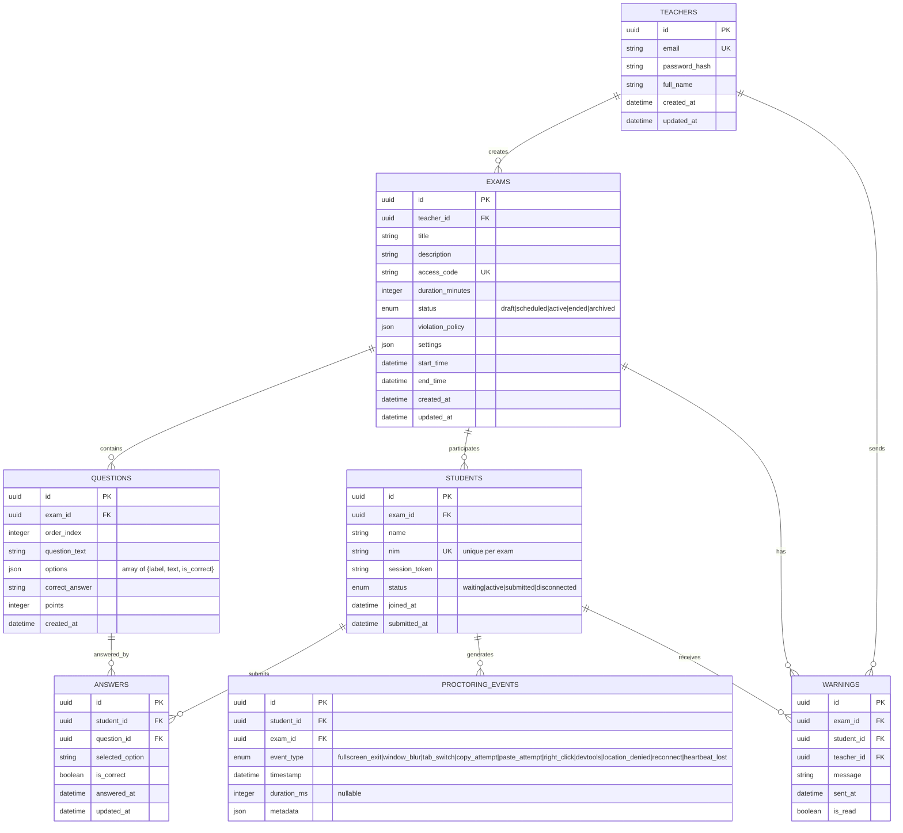
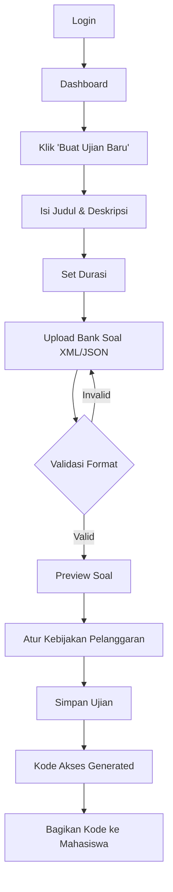
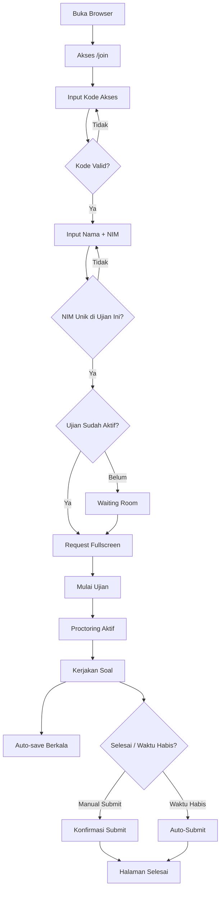
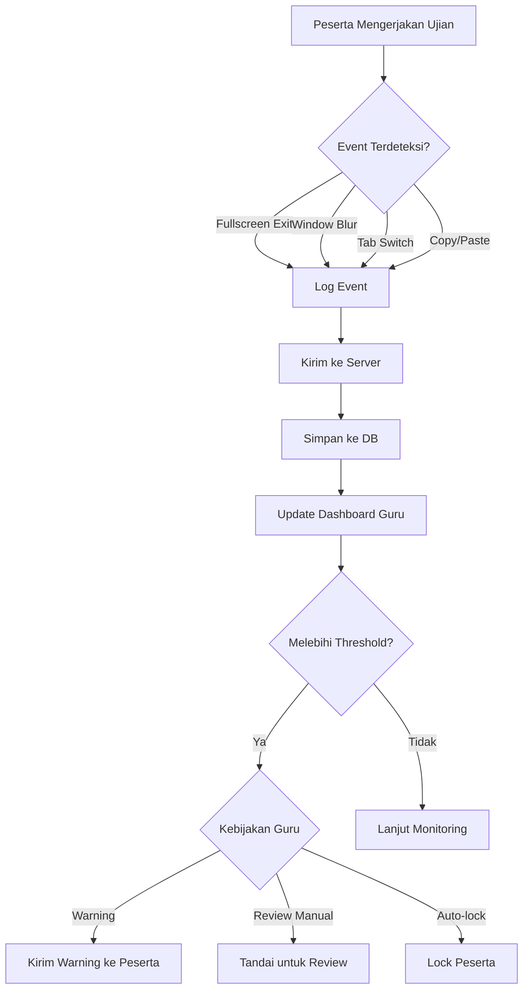
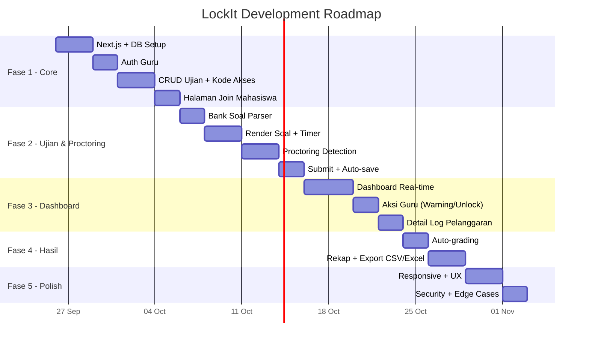

# 📋 Product Requirements Document (PRD)
# LockIt — Platform Ujian Online dengan Web-Based Proctoring

---

| Field | Detail |
|---|---|
| **Nama Produk** | LockIt |
| **Versi PRD** | 1.0 |
| **Tanggal** | 25 September 2026 |
| **Status** | Draft — Menunggu Review |
| **Tech Stack** | Next.js (Full-stack Web) |
| **Repository** | `/home/key/Documents/project/LockIt` |

---

## 1. Problem Statement

Dosen/guru membutuhkan platform ujian online yang:
- **Mudah dipakai** — cukup buat ujian, bagikan kode, mahasiswa langsung join via browser
- **Jujur soal pengawasan** — tidak menjanjikan kunci layar sempurna, tapi mencatat pelanggaran sebagai bukti
- **Cross-platform** — berjalan di Android, iOS, laptop, Mac tanpa install aplikasi tambahan
- **Terukur** — hasil bisa di-auto-grade dan diekspor

Solusi yang ada di pasaran umumnya terlalu berat (butuh install software khusus), mahal, atau over-promise soal kemampuan proctoring mereka. LockIt mengambil pendekatan **best-effort yang jujur**.

---

## 2. User Personas

### Persona 1: Guru/Dosen (Admin Ujian)

| Aspek | Detail |
|---|---|
| **Nama** | Pak Ahmad |
| **Peran** | Dosen Teknik Informatika |
| **Kebutuhan** | Buat ujian online dengan cepat, pantau mahasiswa saat ujian berlangsung, lihat siapa yang mencurigakan |
| **Pain Point** | Platform ujian yang ada terlalu rumit setup-nya, atau menjanjikan "anti-cheating" tapi sebenarnya mudah di-bypass |
| **Harapan** | Platform ringan, dashboard monitoring yang jelas, bukti pelanggaran yang bisa di-review manual |

### Persona 2: Mahasiswa/Siswa (Peserta Ujian)

| Aspek | Detail |
|---|---|
| **Nama** | Siti |
| **Peran** | Mahasiswa semester 5 |
| **Kebutuhan** | Ikut ujian online tanpa ribet — cukup buka browser, masukkan kode, mulai |
| **Pain Point** | Harus install app khusus, app sering crash, atau tidak kompatibel dengan device-nya |
| **Harapan** | Akses ujian dari browser HP/laptop tanpa hambatan teknis |

---

## 3. User Stories

### 3.1 Guru/Dosen

| ID | User Story | Prioritas |
|---|---|---|
| US-G01 | Sebagai guru, saya ingin **login ke dashboard** agar bisa mengelola ujian saya | P0 |
| US-G02 | Sebagai guru, saya ingin **membuat ujian baru** dengan judul, durasi, dan bank soal agar mahasiswa bisa mengikutinya | P0 |
| US-G03 | Sebagai guru, saya ingin **mengupload bank soal** dalam format XML atau JSON agar soal bisa di-render otomatis | P0 |
| US-G04 | Sebagai guru, saya ingin **mendapatkan kode akses unik** setelah membuat ujian agar bisa dibagikan ke mahasiswa | P0 |
| US-G05 | Sebagai guru, saya ingin **menentukan kebijakan pelanggaran** (warning, review manual, dsb.) agar respons terhadap kecurangan bisa dikustomisasi | P1 |
| US-G06 | Sebagai guru, saya ingin **memantau ujian secara real-time** — siapa online, siapa kena pelanggaran, siapa sudah submit | P1 |
| US-G07 | Sebagai guru, saya ingin **mengirim peringatan** ke mahasiswa yang melanggar selama ujian berlangsung | P1 |
| US-G08 | Sebagai guru, saya ingin **meng-unlock mahasiswa** yang terkunci atau terkena masalah teknis | P2 |
| US-G09 | Sebagai guru, saya ingin **melihat detail log pelanggaran** per mahasiswa (timeline + jenis event) sebagai bukti | P1 |
| US-G10 | Sebagai guru, saya ingin **melihat hasil ujian yang sudah di-auto-grade** agar tidak perlu koreksi manual untuk PG | P1 |
| US-G11 | Sebagai guru, saya ingin **mengekspor hasil ujian ke CSV atau Excel** untuk arsip dan pelaporan | P1 |
| US-G12 | Sebagai guru, saya ingin **mengedit atau menghapus ujian** yang sudah dibuat sebelum ujian dimulai | P1 |

### 3.2 Mahasiswa/Siswa

| ID | User Story | Prioritas |
|---|---|---|
| US-M01 | Sebagai mahasiswa, saya ingin **join ujian dengan kode akses** tanpa perlu registrasi/login | P0 |
| US-M02 | Sebagai mahasiswa, saya ingin **mengisi nama dan NIM** saat join agar identitas saya tercatat | P0 |
| US-M03 | Sebagai mahasiswa, saya ingin **mengerjakan soal ujian** yang ditampilkan satu per satu atau sekaligus | P0 |
| US-M04 | Sebagai mahasiswa, saya ingin **melihat sisa waktu ujian** yang akurat (berbasis server) agar bisa mengatur tempo | P0 |
| US-M05 | Sebagai mahasiswa, saya ingin **jawaban saya ter-auto-save** secara berkala agar tidak hilang kalau koneksi putus | P1 |
| US-M06 | Sebagai mahasiswa, saya ingin **submit jawaban** saat selesai atau otomatis ter-submit saat waktu habis | P0 |
| US-M07 | Sebagai mahasiswa, saya ingin **mengakses ujian dari perangkat apa pun** (Android, iOS, laptop, Mac) via browser | P0 |

---

## 4. Functional Requirements

### FR-01: Authentication & Authorization

| ID | Requirement | Detail |
|---|---|---|
| FR-01.1 | Registrasi guru | Form: email, password, nama lengkap. Email verification opsional di v1 |
| FR-01.2 | Login guru | Email + password. Session management via JWT atau cookie |
| FR-01.3 | Proteksi route | Halaman dashboard hanya bisa diakses guru yang sudah login |
| FR-01.4 | Mahasiswa tanpa akun | Mahasiswa **tidak perlu registrasi**. Identifikasi via nama + NIM saat join ujian |

### FR-02: Manajemen Ujian (CRUD)

| ID | Requirement | Detail |
|---|---|---|
| FR-02.1 | Buat ujian | Input: judul, deskripsi (opsional), durasi (menit), bank soal (upload file), kebijakan pelanggaran |
| FR-02.2 | Durasi berbasis VPS | Waktu mulai dan countdown dihitung dari server time, bukan client time. Server mengirim `startTime` dan `endTime` (epoch). Client hanya menampilkan sisa waktu berdasarkan sync dengan server |
| FR-02.3 | Generate kode akses | Kode alfanumerik unik 6-8 karakter (case-insensitive), generated otomatis saat ujian dibuat. Bisa di-regenerate jika bocor |
| FR-02.4 | Edit ujian | Bisa edit judul, durasi, bank soal, kebijakan **sebelum** ujian dimulai. Setelah ada peserta aktif, hanya kebijakan yang bisa diubah |
| FR-02.5 | Hapus ujian | Soft delete. Ujian yang sudah ada peserta/hasil tetap tersimpan tapi ditandai "archived" |
| FR-02.6 | Daftar ujian | Guru melihat semua ujian miliknya: draft, aktif, selesai, archived |
| FR-02.7 | Status ujian | State machine: `draft` → `scheduled` → `active` → `ended` → `archived` |

### FR-03: Bank Soal

| ID | Requirement | Detail |
|---|---|---|
| FR-03.1 | Format soal XML | Support import soal dari file XML dengan schema yang didefinisikan (lihat section 7) |
| FR-03.2 | Format soal JSON | Support import soal dari file JSON dengan schema yang didefinisikan (lihat section 7) |
| FR-03.3 | Tipe soal v1 | Pilihan ganda (single answer) — support 4-5 opsi per soal. Tipe soal lain (essay, isian singkat) bisa ditambah di versi berikutnya |
| FR-03.4 | Validasi soal | Saat upload, sistem memvalidasi format file dan memberikan error message yang jelas jika format salah |
| FR-03.5 | Preview soal | Guru bisa preview soal yang sudah diupload sebelum ujian dipublikasikan |
| FR-03.6 | Randomisasi | Urutan soal bisa diacak per peserta (opsional, diatur guru) |

### FR-04: Alur Peserta (Join & Ujian)

| ID | Requirement | Detail |
|---|---|---|
| FR-04.1 | Halaman join | Landing page publik: input kode akses → validasi → form nama + NIM |
| FR-04.2 | Validasi kode | Cek kode valid, ujian dalam status `active`, dan belum expired |
| FR-04.3 | Validasi NIM | Cek NIM unik per ujian (satu NIM tidak bisa join dua kali di ujian yang sama) |
| FR-04.4 | Waiting room | Setelah join, peserta masuk waiting room sampai ujian dimulai (jika ujian belum `active`) |
| FR-04.5 | Render soal | Tampilkan soal dari bank soal. Mode: satu per satu (navigasi prev/next) atau semua sekaligus (scroll) — diatur guru |
| FR-04.6 | Timer client | Countdown timer yang sync dengan server time. Menampilkan sisa waktu. Warning visual saat sisa waktu < 5 menit |
| FR-04.7 | Auto-save | Jawaban peserta di-save otomatis setiap 30 detik (interval configurable) ke server |
| FR-04.8 | Submit manual | Peserta bisa submit kapan saja sebelum waktu habis. Konfirmasi dialog sebelum submit |
| FR-04.9 | Auto-submit | Saat waktu habis, jawaban terakhir yang ter-save otomatis di-submit |
| FR-04.10 | Fullscreen request | Saat ujian dimulai, sistem request masuk fullscreen mode. Jika ditolak, tetap bisa lanjut tapi dicatat |

### FR-05: Proctoring Best-Effort

> [!IMPORTANT]
> Filosofi: **Deteksi dan catat semampunya. Log dengan jujur. Tidak menjanjikan anti-bypass.**

| ID | Requirement | Detail |
|---|---|---|
| FR-05.1 | Fullscreen exit detection | Deteksi saat peserta keluar dari fullscreen via `fullscreenchange` event. Catat timestamp + duration |
| FR-05.2 | Window blur detection | Deteksi saat window kehilangan fokus via `visibilitychange` dan `blur` event. Catat timestamp + duration |
| FR-05.3 | Tab switch counter | Hitung jumlah kali peserta switch tab/window. Threshold pelanggaran ditentukan guru (default: 3x = warning) |
| FR-05.4 | Copy/paste detection | (Opsional, diatur guru) Deteksi attempt copy dan paste via `oncopy`/`onpaste`. Catat timestamp |
| FR-05.5 | Right-click/devtools detection | (Opsional) Deteksi right-click (`oncontextmenu`) dan shortcut devtools (Ctrl+Shift+I, F12). Best-effort, mudah di-bypass |
| FR-05.6 | Geolocation detection | (Opsional, diatur guru) Request lokasi peserta saat mulai ujian. Jika ditolak, dicatat sebagai "location denied" |
| FR-05.7 | Event logging | Setiap event proctoring disimpan ke database dengan: `student_id`, `exam_id`, `event_type`, `timestamp`, `metadata` (detail tambahan) |
| FR-05.8 | Heartbeat | Client kirim heartbeat setiap 10 detik ke server. Jika tidak ada heartbeat > 30 detik, peserta ditandai "offline/disconnected" |
| FR-05.9 | Reconnect handling | Jika peserta disconnect dan reconnect, sesi dilanjutkan (bukan mulai ulang). Event reconnect dicatat |

### FR-06: Dashboard Real-Time Guru

| ID | Requirement | Detail |
|---|---|---|
| FR-06.1 | Overview ujian aktif | Card/panel: jumlah peserta join, online, offline, sudah submit, belum submit |
| FR-06.2 | Daftar peserta live | Tabel peserta dengan kolom: nama, NIM, status (online/offline/submitted), jumlah pelanggaran, last activity |
| FR-06.3 | Indikator pelanggaran | Badge/icon warna pada peserta yang memiliki pelanggaran. Merah = banyak, kuning = sedikit, hijau = bersih |
| FR-06.4 | Detail pelanggaran | Klik peserta → lihat timeline pelanggaran: jenis event, timestamp, duration (jika applicable) |
| FR-06.5 | Aksi: kirim warning | Guru bisa kirim pesan warning ke peserta tertentu yang muncul sebagai notifikasi di layar ujian peserta |
| FR-06.6 | Aksi: unlock peserta | Jika peserta terkunci (misal: terlalu banyak pelanggaran dan policy = auto-lock), guru bisa unlock manual |
| FR-06.7 | Real-time update | Dashboard update otomatis tanpa perlu refresh manual. Teknologi: WebSocket, SSE, atau polling interval pendek |
| FR-06.8 | Notifikasi pelanggaran | Guru mendapat notifikasi (visual/audio) saat ada pelanggaran baru yang terjadi |

### FR-07: Grading & Export

| ID | Requirement | Detail |
|---|---|---|
| FR-07.1 | Auto-grading PG | Soal pilihan ganda di-grade otomatis berdasarkan kunci jawaban di bank soal |
| FR-07.2 | Rekap nilai | Halaman rekap: tabel semua peserta + nilai, statistik (rata-rata, min, max, distribusi) |
| FR-07.3 | Detail jawaban | Guru bisa lihat jawaban per peserta: soal mana yang benar/salah |
| FR-07.4 | Export CSV | Download hasil ujian dalam format CSV: nama, NIM, nilai, jumlah pelanggaran |
| FR-07.5 | Export Excel | Download hasil ujian dalam format XLSX dengan formatting: header, border, conditional coloring |
| FR-07.6 | Export log pelanggaran | (Opsional) Export detail pelanggaran per ujian sebagai lampiran terpisah |

---

## 5. Non-Functional Requirements

### NFR-01: Performa

| ID | Requirement | Target |
|---|---|---|
| NFR-01.1 | Page load time | < 3 detik pada koneksi 3G |
| NFR-01.2 | Concurrent users | Support minimal 100 peserta per ujian secara bersamaan |
| NFR-01.3 | Auto-save latency | < 2 detik dari client ke server |
| NFR-01.4 | Dashboard refresh rate | Real-time update ≤ 5 detik delay |
| NFR-01.5 | Heartbeat overhead | Minimal bandwidth usage (< 1KB per heartbeat) |

### NFR-02: Keamanan

| ID | Requirement | Detail |
|---|---|---|
| NFR-02.1 | Password hashing | bcrypt atau argon2, minimum 10 rounds |
| NFR-02.2 | Input sanitization | Semua input di-sanitize untuk mencegah XSS dan SQL injection |
| NFR-02.3 | Rate limiting | Login: max 5 attempts per 15 menit. API: max 100 req/menit per IP |
| NFR-02.4 | HTTPS only | Semua komunikasi via HTTPS. HTTP redirect ke HTTPS |
| NFR-02.5 | Kode akses entropy | Kode 6-8 karakter alfanumerik = ~36^6 kemungkinan. Cukup untuk konteks ini |
| NFR-02.6 | Session management | JWT dengan expiry 24 jam (guru). Peserta: session berlaku selama ujian aktif |

### NFR-03: Kompatibilitas

| ID | Requirement | Target |
|---|---|---|
| NFR-03.1 | Browser desktop | Chrome 90+, Firefox 90+, Safari 15+, Edge 90+ |
| NFR-03.2 | Browser mobile | Chrome Android, Safari iOS (2 versi terakhir) |
| NFR-03.3 | Responsive | Fully responsive: mobile (360px+), tablet (768px+), desktop (1024px+) |
| NFR-03.4 | Fullscreen API | Graceful degradation jika browser tidak support Fullscreen API (terutama iOS Safari) |

### NFR-04: Reliabilitas

| ID | Requirement | Detail |
|---|---|---|
| NFR-04.1 | Auto-save resilience | Jika server unreachable, jawaban di-queue di client dan retry saat reconnect |
| NFR-04.2 | Graceful degradation | Proctoring event yang gagal terkirim di-buffer dan dikirim saat koneksi pulih |
| NFR-04.3 | Data integrity | Jawaban yang sudah ter-submit tidak bisa diubah oleh peserta |

---

## 6. Data Model



---

## 7. Bank Soal Schema

### Format JSON

```json
{
  "exam_title": "UTS Pemrograman Web",
  "questions": [
    {
      "id": 1,
      "text": "Apa kepanjangan dari HTML?",
      "type": "multiple_choice",
      "points": 10,
      "options": [
        { "label": "A", "text": "Hyper Text Markup Language", "is_correct": true },
        { "label": "B", "text": "High Tech Modern Language", "is_correct": false },
        { "label": "C", "text": "Home Tool Markup Language", "is_correct": false },
        { "label": "D", "text": "Hyperlink Text Mark Language", "is_correct": false }
      ]
    }
  ]
}
```

### Format XML

```xml
<?xml version="1.0" encoding="UTF-8"?>
<exam title="UTS Pemrograman Web">
  <question id="1" type="multiple_choice" points="10">
    <text>Apa kepanjangan dari HTML?</text>
    <options>
      <option label="A" correct="true">Hyper Text Markup Language</option>
      <option label="B" correct="false">High Tech Modern Language</option>
      <option label="C" correct="false">Home Tool Markup Language</option>
      <option label="D" correct="false">Hyperlink Text Mark Language</option>
    </options>
  </question>
</exam>
```

---

## 8. API Endpoint Inventory

### Auth

| Method | Endpoint | Deskripsi |
|---|---|---|
| POST | `/api/auth/register` | Registrasi guru baru |
| POST | `/api/auth/login` | Login guru |
| POST | `/api/auth/logout` | Logout guru |
| GET | `/api/auth/me` | Get current user info |

### Exam Management

| Method | Endpoint | Deskripsi |
|---|---|---|
| GET | `/api/exams` | List semua ujian milik guru |
| POST | `/api/exams` | Buat ujian baru |
| GET | `/api/exams/:id` | Detail ujian |
| PUT | `/api/exams/:id` | Update ujian |
| DELETE | `/api/exams/:id` | Soft delete ujian |
| POST | `/api/exams/:id/regenerate-code` | Generate kode akses baru |
| PUT | `/api/exams/:id/status` | Ubah status ujian (start/end) |

### Bank Soal

| Method | Endpoint | Deskripsi |
|---|---|---|
| POST | `/api/exams/:id/questions/upload` | Upload bank soal (XML/JSON) |
| GET | `/api/exams/:id/questions` | List soal dalam ujian |
| GET | `/api/exams/:id/questions/preview` | Preview soal (untuk guru) |

### Student Flow

| Method | Endpoint | Deskripsi |
|---|---|---|
| POST | `/api/join` | Join ujian dengan kode akses + nama + NIM |
| GET | `/api/exam-session` | Get soal dan metadata ujian (untuk peserta) |
| POST | `/api/exam-session/answer` | Submit/update jawaban (auto-save) |
| POST | `/api/exam-session/submit` | Submit final |
| POST | `/api/exam-session/heartbeat` | Heartbeat peserta |

### Proctoring

| Method | Endpoint | Deskripsi |
|---|---|---|
| POST | `/api/proctoring/event` | Log proctoring event dari client |
| POST | `/api/proctoring/events/batch` | Batch log events (jika buffer) |

### Dashboard (Guru)

| Method | Endpoint | Deskripsi |
|---|---|---|
| GET | `/api/exams/:id/dashboard` | Data dashboard real-time |
| GET | `/api/exams/:id/students` | List peserta + status |
| GET | `/api/exams/:id/students/:sid/violations` | Detail pelanggaran peserta |
| POST | `/api/exams/:id/students/:sid/warn` | Kirim warning ke peserta |
| POST | `/api/exams/:id/students/:sid/unlock` | Unlock peserta |
| WebSocket | `/ws/exam/:id/dashboard` | Real-time updates dashboard |

### Grading & Export

| Method | Endpoint | Deskripsi |
|---|---|---|
| GET | `/api/exams/:id/results` | Rekap hasil ujian |
| GET | `/api/exams/:id/results/:sid` | Detail jawaban peserta |
| GET | `/api/exams/:id/export/csv` | Export CSV |
| GET | `/api/exams/:id/export/xlsx` | Export Excel |

---

## 9. Page/Screen Inventory

### Halaman Guru

| Halaman | Route | Deskripsi |
|---|---|---|
| Login | `/login` | Form login guru |
| Register | `/register` | Form registrasi guru |
| Dashboard | `/dashboard` | List semua ujian + quick stats |
| Buat Ujian | `/dashboard/exams/new` | Form pembuatan ujian |
| Edit Ujian | `/dashboard/exams/:id/edit` | Form edit ujian |
| Detail Ujian | `/dashboard/exams/:id` | Detail ujian + kode akses |
| Monitoring Live | `/dashboard/exams/:id/monitor` | Dashboard real-time selama ujian |
| Detail Pelanggaran | `/dashboard/exams/:id/violations/:sid` | Timeline pelanggaran per peserta |
| Hasil Ujian | `/dashboard/exams/:id/results` | Rekap nilai + export |
| Detail Jawaban | `/dashboard/exams/:id/results/:sid` | Jawaban per peserta |

### Halaman Mahasiswa

| Halaman | Route | Deskripsi |
|---|---|---|
| Join Ujian | `/join` | Input kode akses |
| Identitas | `/join/identity` | Form nama + NIM |
| Waiting Room | `/exam/waiting` | Menunggu ujian dimulai |
| Ujian | `/exam/session` | Halaman ujian (soal + timer + proctoring) |
| Selesai | `/exam/done` | Konfirmasi submit berhasil |

---

## 10. User Flow Diagrams

### Flow Guru: Membuat Ujian



### Flow Mahasiswa: Mengikuti Ujian



### Flow Proctoring Event



---

## 11. Acceptance Criteria

### AC-01: Pembuatan Ujian

- [ ] Guru bisa membuat ujian dengan judul, durasi, dan bank soal
- [ ] Bank soal bisa diupload dalam format XML dan JSON
- [ ] Sistem memvalidasi format file dan menampilkan error yang jelas jika invalid
- [ ] Kode akses unik 6-8 karakter ter-generate otomatis
- [ ] Kode akses bisa di-regenerate jika bocor
- [ ] Ujian bisa diedit sebelum ada peserta aktif

### AC-02: Join & Ujian Mahasiswa

- [ ] Mahasiswa bisa join dengan kode akses tanpa registrasi
- [ ] NIM dicek unik per ujian (tidak bisa join ulang)
- [ ] Timer countdown akurat dan sync dengan server time
- [ ] Jawaban ter-auto-save setiap 30 detik
- [ ] Submit manual dan auto-submit (waktu habis) berfungsi
- [ ] Ujian bisa diakses dari Chrome Android, Safari iOS, dan browser desktop

### AC-03: Proctoring

- [ ] Fullscreen exit terdeteksi dan tercatat dengan timestamp
- [ ] Window blur/tab switch terdeteksi dan tercatat
- [ ] Counter pelanggaran terakumulasi per peserta
- [ ] Event yang gagal terkirim di-buffer dan retry
- [ ] Heartbeat berjalan setiap 10 detik
- [ ] Peserta offline terdeteksi jika heartbeat hilang > 30 detik

### AC-04: Dashboard Real-Time

- [ ] Dashboard menampilkan jumlah peserta online/offline/submitted
- [ ] Pelanggaran baru muncul di dashboard dalam ≤ 5 detik
- [ ] Guru bisa klik peserta dan lihat detail timeline pelanggaran
- [ ] Guru bisa kirim warning yang muncul sebagai notifikasi di layar peserta
- [ ] Guru bisa unlock peserta yang terkunci

### AC-05: Grading & Export

- [ ] Soal PG di-auto-grade berdasarkan kunci jawaban
- [ ] Halaman rekap menampilkan tabel nilai + statistik
- [ ] Export CSV berisi: nama, NIM, nilai, jumlah pelanggaran
- [ ] Export Excel memiliki formatting yang layak (header, border)

---

## 12. Batasan & Risiko

### Batasan yang Diterima

| # | Batasan | Alasan |
|---|---|---|
| 1 | Proctoring **bukan** kunci layar sempurna | Web API tidak punya kontrol OS-level. Ini design decision, bukan bug |
| 2 | Fullscreen bisa di-dismiss user kapan saja | Browser spec mengharuskan fullscreen bisa di-exit oleh user |
| 3 | iOS Safari limited fullscreen support | Safari mobile tidak support Fullscreen API penuh — graceful degradation |
| 4 | Devtools detection mudah di-bypass | User bisa disable JavaScript, pakai profile lain, dll. Best-effort saja |
| 5 | Geolocation butuh izin eksplisit | User bisa menolak, dan kita catat "denied" — tidak bisa dipaksa |
| 6 | V1 hanya soal PG | Tipe soal lain (essay, isian) di-scope untuk versi berikutnya |

### Risiko

| # | Risiko | Mitigasi |
|---|---|---|
| 1 | Koneksi internet peserta tidak stabil | Auto-save + reconnect handling + buffer events |
| 2 | Banyak peserta sekaligus → server lambat | Optimasi query, caching, horizontal scaling jika perlu |
| 3 | NIM palsu / identitas palsu | Out of scope v1 — bisa ditambahkan verifikasi tambahan nanti |
| 4 | Bank soal bocor via client-side inspection | Soal dikirim per-batch, bukan sekaligus. Obfuscation minimal tapi bukan fokus utama |
| 5 | Timezone confusion | Semua waktu mengacu ke server/VPS time. Client hanya display countdown |

---

## 13. Roadmap & Milestones



---

## 14. Out of Scope (V1)

Fitur-fitur berikut **tidak** termasuk dalam scope v1 tetapi bisa ditambahkan di iterasi berikutnya:

- Tipe soal selain PG (essay, isian singkat, matching)
- Webcam/screen recording proctoring
- Face recognition / identity verification
- Multi-language support
- Offline exam mode
- Integrasi LMS (Moodle, Google Classroom)
- Mobile native app (Android/iOS)
- Analitik performa mahasiswa (trend, progress)
- Grading rubrik untuk soal essay
- Collaborative exam creation (multi-teacher)

---

> [!NOTE]
> Dokumen ini adalah **living document**. Akan di-update seiring development berjalan dan keputusan arsitektur diambil. Keputusan penting dicatat di `Projects/lockit/decisions/`.
