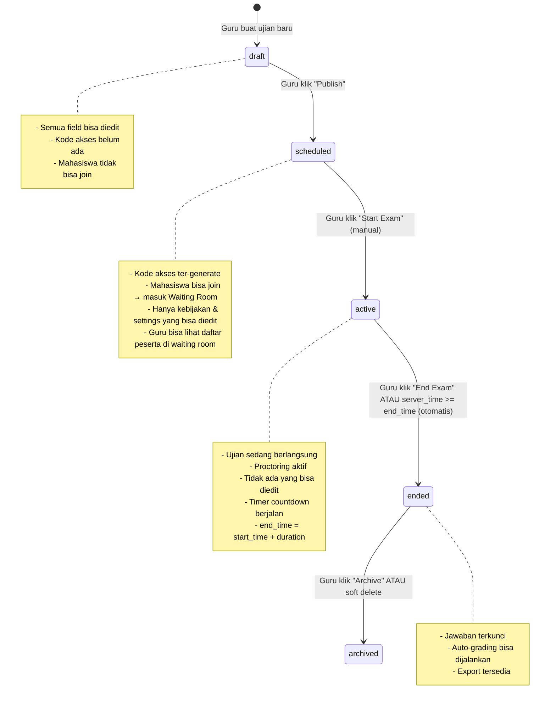
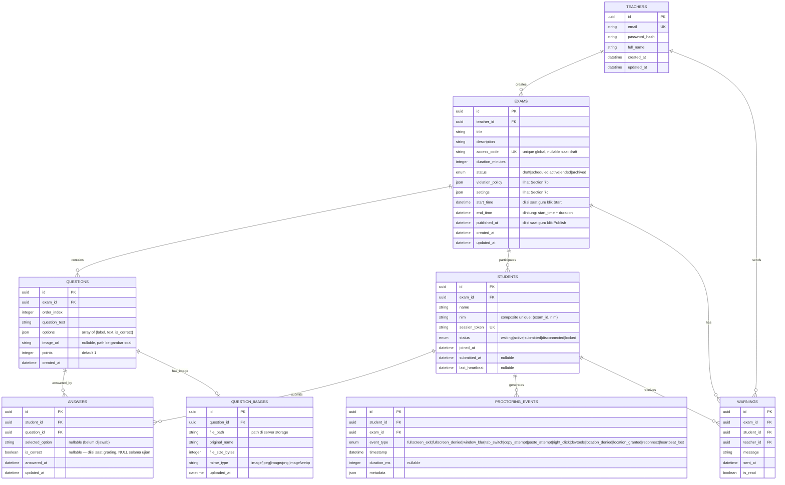
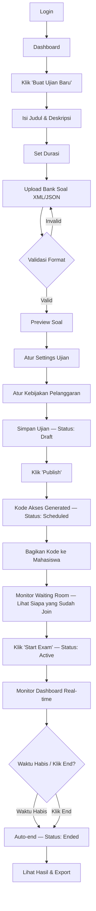
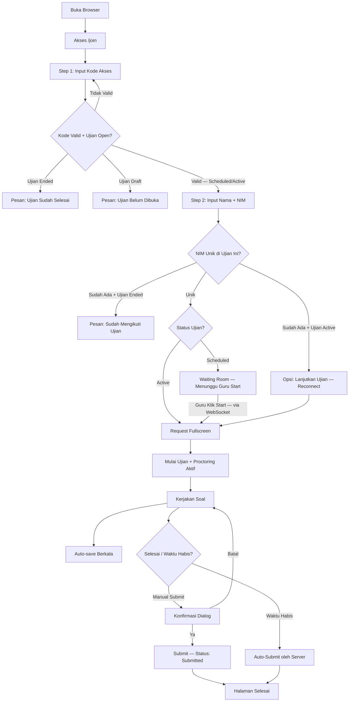
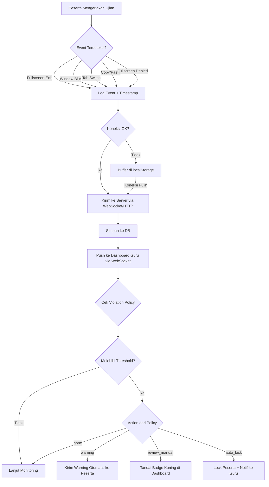
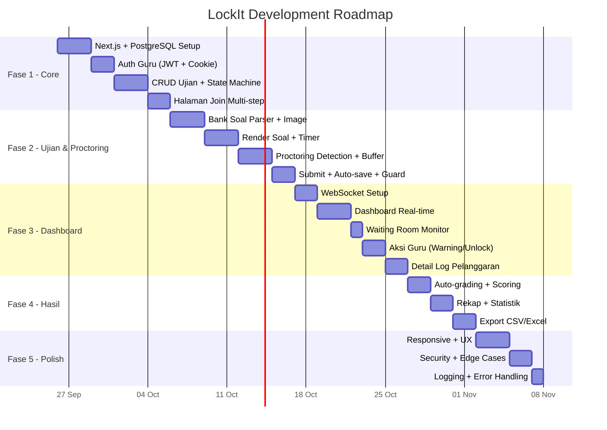

# 📋 Product Requirements Document (PRD)
# LockIt — Platform Ujian Online dengan Web-Based Proctoring

---

| Field | Detail |
|---|---|
| **Nama Produk** | LockIt |
| **Versi PRD** | 2.0 |
| **Tanggal** | 25 September 2026 |
| **Status** | Reviewed — Siap Development |
| **Tech Stack** | Next.js (Full-stack Web), PostgreSQL |
| **Repository** | `/home/key/Documents/project/LockIt` |

---

## 1. Problem Statement

Dosen/guru membutuhkan platform ujian online yang:
- **Mudah dipakai** — cukup buat ujian, bagikan kode, mahasiswa langsung join via browser
- **Jujur soal pengawasan** — tidak menjanjikan kunci layar sempurna, tapi mencatat pelanggaran sebagai bukti
- **Cross-platform** — berjalan di Android, iOS, laptop, Mac tanpa install aplikasi tambahan
- **Terukur** — hasil bisa di-auto-grade dan diekspor

Solusi yang ada di pasaran umumnya terlalu berat (butuh install software khusus), mahal, atau over-promise soal kemampuan proctoring mereka. LockIt mengambil pendekatan **best-effort yang jujur**.

---

## 2. User Personas

### Persona 1: Guru/Dosen (Admin Ujian)

| Aspek | Detail |
|---|---|
| **Nama** | Pak Ahmad |
| **Peran** | Dosen Teknik Informatika |
| **Kebutuhan** | Buat ujian online dengan cepat, pantau mahasiswa saat ujian berlangsung, lihat siapa yang mencurigakan |
| **Pain Point** | Platform ujian yang ada terlalu rumit setup-nya, atau menjanjikan "anti-cheating" tapi sebenarnya mudah di-bypass |
| **Harapan** | Platform ringan, dashboard monitoring yang jelas, bukti pelanggaran yang bisa di-review manual |

### Persona 2: Mahasiswa/Siswa (Peserta Ujian)

| Aspek | Detail |
|---|---|
| **Nama** | Siti |
| **Peran** | Mahasiswa semester 5 |
| **Kebutuhan** | Ikut ujian online tanpa ribet — cukup buka browser, masukkan kode, mulai |
| **Pain Point** | Harus install app khusus, app sering crash, atau tidak kompatibel dengan device-nya |
| **Harapan** | Akses ujian dari browser HP/laptop tanpa hambatan teknis |

---

## 3. User Stories

### 3.1 Guru/Dosen

| ID | User Story | Prioritas |
|---|---|---|
| US-G01 | Sebagai guru, saya ingin **login ke dashboard** agar bisa mengelola ujian saya | P0 |
| US-G02 | Sebagai guru, saya ingin **membuat ujian baru** dengan judul, durasi, dan bank soal agar mahasiswa bisa mengikutinya | P0 |
| US-G03 | Sebagai guru, saya ingin **mengupload bank soal** dalam format XML atau JSON agar soal bisa di-render otomatis | P0 |
| US-G04 | Sebagai guru, saya ingin **mendapatkan kode akses unik** setelah membuat ujian agar bisa dibagikan ke mahasiswa | P0 |
| US-G05 | Sebagai guru, saya ingin **menentukan kebijakan pelanggaran** (warning, review manual, dsb.) agar respons terhadap kecurangan bisa dikustomisasi | P1 |
| US-G06 | Sebagai guru, saya ingin **memantau ujian secara real-time** — siapa online, siapa di waiting room, siapa kena pelanggaran, siapa sudah submit | P1 |
| US-G07 | Sebagai guru, saya ingin **mengirim peringatan** ke mahasiswa yang melanggar selama ujian berlangsung | P1 |
| US-G08 | Sebagai guru, saya ingin **meng-unlock mahasiswa** yang terkunci atau terkena masalah teknis | P2 |
| US-G09 | Sebagai guru, saya ingin **melihat detail log pelanggaran** per mahasiswa (timeline + jenis event) sebagai bukti | P1 |
| US-G10 | Sebagai guru, saya ingin **melihat hasil ujian yang sudah di-auto-grade** agar tidak perlu koreksi manual untuk PG | P1 |
| US-G11 | Sebagai guru, saya ingin **mengekspor hasil ujian ke CSV atau Excel** untuk arsip dan pelaporan | P1 |
| US-G12 | Sebagai guru, saya ingin **mengedit atau menghapus ujian** yang sudah dibuat sebelum ujian dimulai | P1 |
| US-G13 | Sebagai guru, saya ingin **melihat daftar peserta di waiting room** sebelum memulai ujian agar tahu siapa saja yang sudah siap | P1 |
| US-G14 | Sebagai guru, saya ingin **mem-publish ujian** agar mahasiswa bisa mulai join dengan kode akses, tanpa ujian langsung dimulai | P0 |

### 3.2 Mahasiswa/Siswa

| ID | User Story | Prioritas |
|---|---|---|
| US-M01 | Sebagai mahasiswa, saya ingin **join ujian dengan kode akses** tanpa perlu registrasi/login | P0 |
| US-M02 | Sebagai mahasiswa, saya ingin **mengisi nama dan NIM** saat join agar identitas saya tercatat | P0 |
| US-M03 | Sebagai mahasiswa, saya ingin **mengerjakan soal ujian** yang ditampilkan satu per satu atau sekaligus | P0 |
| US-M04 | Sebagai mahasiswa, saya ingin **melihat sisa waktu ujian** yang akurat (berbasis server) agar bisa mengatur tempo | P0 |
| US-M05 | Sebagai mahasiswa, saya ingin **jawaban saya ter-auto-save** secara berkala agar tidak hilang kalau koneksi putus | P1 |
| US-M06 | Sebagai mahasiswa, saya ingin **submit jawaban** saat selesai atau otomatis ter-submit saat waktu habis | P0 |
| US-M07 | Sebagai mahasiswa, saya ingin **mengakses ujian dari perangkat apa pun** (Android, iOS, laptop, Mac) via browser | P0 |

---

## 4. Functional Requirements

### FR-01: Authentication & Authorization

| ID | Requirement | Detail |
|---|---|---|
| FR-01.1 | Registrasi guru | Form: email, password, nama lengkap. Email verification opsional di v1 |
| FR-01.2 | Login guru | Email + password. Session management via JWT (httpOnly cookie) |
| FR-01.3 | Proteksi route | Halaman dashboard hanya bisa diakses guru yang sudah login |
| FR-01.4 | Mahasiswa tanpa akun | Mahasiswa **tidak perlu registrasi/login**. Identifikasi via nama + NIM saat join ujian. Setiap ujian, peserta mengisi identitas ulang |
| FR-01.5 | Session peserta | Setelah join, peserta mendapat `session_token` yang disimpan sebagai **httpOnly cookie**. Token ini digunakan untuk semua request selama ujian berlangsung. Jika browser ditutup dan dibuka kembali, cookie dipakai untuk reconnect otomatis |
| FR-01.6 | Reconnect peserta | Jika peserta disconnect (browser crash, koneksi putus, tab ditutup) lalu kembali: (1) Cek cookie `session_token`, (2) Jika valid + ujian masih active → resume sesi dari jawaban terakhir yang ter-save, (3) Jika cookie hilang/invalid → peserta harus join ulang via kode akses, tapi jika NIM sudah terdaftar + ujian masih active → sistem menampilkan opsi "Lanjutkan ujian" dan generate token baru, melanjutkan dari jawaban terakhir. Event reconnect dicatat sebagai proctoring event |

### FR-02: Manajemen Ujian (CRUD)

| ID | Requirement | Detail |
|---|---|---|
| FR-02.1 | Buat ujian | Input: judul, deskripsi (opsional), durasi (menit), bank soal (upload file), kebijakan pelanggaran, settings ujian |
| FR-02.2 | Durasi berbasis VPS (Fixed Window) | Waktu ujian menggunakan model **Fixed Window**: saat guru klik "Start", server mencatat `start_time = now()` dan menghitung `end_time = start_time + duration_minutes`. **Semua peserta berbagi `end_time` yang sama.** Peserta yang join telat kehilangan waktu — countdown mereka = `end_time - server_now`. Client menampilkan sisa waktu berdasarkan sync dengan server |
| FR-02.3 | Generate kode akses | Kode alfanumerik unik 6-8 karakter (case-insensitive), generated otomatis saat ujian di-publish. Bisa di-regenerate jika bocor. Unique secara global selama ujian belum `archived` (kode ujian `archived` bisa di-recycle) |
| FR-02.4 | Edit ujian | Bisa edit judul, durasi, bank soal, kebijakan, settings **selama status `draft`**. Setelah di-publish (`scheduled`), hanya kebijakan pelanggaran dan settings tampilan yang bisa diubah. Setelah `active`, tidak ada yang bisa diubah |
| FR-02.5 | Hapus ujian | Soft delete. Ujian yang sudah ada peserta/hasil tetap tersimpan tapi ditandai `archived` |
| FR-02.6 | Daftar ujian | Guru melihat semua ujian miliknya: draft, scheduled, active, ended, archived |
| FR-02.7 | Status ujian (State Machine) | Transisi status ujian yang eksplisit — lihat detail di bawah |

#### State Machine Ujian



**Aturan transisi:**
- `draft → scheduled`: Guru klik "Publish". Validasi: bank soal sudah diupload dan minimal 1 soal valid. Kode akses di-generate saat ini.
- `scheduled → active`: Guru klik "Start Exam" secara **manual**. Tidak ada auto-start. Server set `start_time = now()`, `end_time = now() + duration_minutes`.
- `active → ended`: **Otomatis** saat `server_time >= end_time`. Atau guru klik "End Exam" lebih awal. Semua peserta yang belum submit akan di-auto-submit.
- `ended → archived`: Guru klik "Archive". Data tetap tersimpan tapi ujian ditandai archived.

### FR-03: Bank Soal

| ID | Requirement | Detail |
|---|---|---|
| FR-03.1 | Format soal XML | Support import soal dari file XML dengan schema yang didefinisikan (lihat section 7) |
| FR-03.2 | Format soal JSON | Support import soal dari file JSON dengan schema yang didefinisikan (lihat section 7) |
| FR-03.3 | Tipe soal v1 | Pilihan ganda (single answer) — support 4-5 opsi per soal. Tipe soal lain (essay, isian singkat) bisa ditambah di versi berikutnya |
| FR-03.4 | Validasi soal | Saat upload, sistem memvalidasi: format file benar, minimal 1 soal, setiap soal punya minimal 2 opsi, tepat 1 opsi `is_correct: true`, dan file size ≤ 10MB. Error message yang jelas jika validasi gagal |
| FR-03.5 | Preview soal | Guru bisa preview soal yang sudah diupload sebelum ujian dipublikasikan |
| FR-03.6 | Randomisasi | Urutan soal bisa diacak per peserta (opsional, diatur guru via settings) |
| FR-03.7 | Gambar dalam soal | Soal bisa menyertakan gambar. Gambar di-upload bersamaan dengan file bank soal (via URL reference atau base64-encoded di JSON/XML). Gambar disimpan di server storage. Maks 2MB per gambar, format: JPG, PNG, WebP |
| FR-03.8 | Batasan | Maks 500 soal per ujian. Maks file upload: 10MB per file (termasuk gambar jika base64) |

### FR-04: Alur Peserta (Join & Ujian)

| ID | Requirement | Detail |
|---|---|---|
| FR-04.1 | Halaman join (multi-step) | **Satu halaman** dengan 2 step: Step 1 — input kode akses → validasi. Step 2 — form nama + NIM. Navigasi antar step tanpa berpindah route |
| FR-04.2 | Validasi kode | Cek kode valid dan ujian dalam status `scheduled` atau `active`. Jika `draft` atau `ended` → tampilkan pesan yang sesuai ("Ujian belum dibuka" / "Ujian sudah selesai") |
| FR-04.3 | Validasi NIM | Cek NIM unik per ujian (composite unique: `exam_id + nim`). Jika NIM sudah terdaftar dan ujian masih active → tampilkan opsi "Lanjutkan ujian" (reconnect). Jika ujian sudah ended → tampilkan "Anda sudah mengikuti ujian ini" |
| FR-04.4 | Waiting room | Setelah join saat status `scheduled`, peserta masuk waiting room. Peserta di waiting room terlihat di dashboard guru. Saat guru klik "Start Exam", semua peserta di waiting room menerima sinyal via WebSocket dan otomatis dialihkan ke halaman ujian |
| FR-04.5 | Render soal | Tampilkan soal dari bank soal. Mode: satu per satu (navigasi prev/next) atau semua sekaligus (scroll) — diatur guru via settings. Soal dengan gambar di-render inline |
| FR-04.6 | Timer client | Countdown timer yang sync dengan server time. Server mengirim `end_time` (epoch). Client menampilkan sisa waktu = `end_time - server_now`. Warning visual saat sisa waktu < 5 menit. Warning tambahan saat sisa waktu < 1 menit |
| FR-04.7 | Auto-save | Jawaban peserta di-save otomatis setiap 30 detik (interval configurable via settings) ke server. Server merespon `{ saved: true }` atau `{ error: "exam_already_submitted" }` jika ujian sudah di-submit |
| FR-04.8 | Submit manual | Peserta bisa submit kapan saja sebelum waktu habis. Konfirmasi dialog sebelum submit: "Yakin submit? Jawaban tidak bisa diubah setelah submit." |
| FR-04.9 | Auto-submit | Saat `server_time >= end_time`: (1) Server set `student.status = "submitted"` dan `submitted_at = now()`, (2) Server reject semua `/answer` request berikutnya untuk student tersebut, (3) Jawaban terakhir yang ter-save menjadi jawaban final, (4) Client menampilkan halaman "Ujian Selesai" |
| FR-04.10 | Fullscreen request | Saat ujian dimulai, sistem request masuk fullscreen mode. Jika ditolak, tetap bisa lanjut tapi dicatat sebagai event `fullscreen_denied` |
| FR-04.11 | Edge cases join | (1) Join saat ujian `ended` → "Ujian sudah selesai", (2) Join saat ujian `draft` → "Ujian belum tersedia", (3) Join saat ujian `archived` → "Ujian tidak ditemukan", (4) Race condition 2 browser sama NIM bersamaan → first-write-wins, yang kedua dapat error "NIM sudah terdaftar" |

### FR-05: Proctoring Best-Effort

> [!IMPORTANT]
> Filosofi: **Deteksi dan catat semampunya. Log dengan jujur. Tidak menjanjikan anti-bypass.**

| ID | Requirement | Detail |
|---|---|---|
| FR-05.1 | Fullscreen exit detection | Deteksi saat peserta keluar dari fullscreen via `fullscreenchange` event. Catat timestamp + duration |
| FR-05.2 | Fullscreen denied detection | Deteksi saat peserta menolak request fullscreen saat awal ujian. Catat sebagai event `fullscreen_denied` |
| FR-05.3 | Window blur detection | Deteksi saat window kehilangan fokus via `visibilitychange` dan `blur` event. Catat timestamp + duration |
| FR-05.4 | Tab switch counter | Hitung jumlah kali peserta switch tab/window. Threshold pelanggaran ditentukan guru via violation_policy |
| FR-05.5 | Copy/paste detection | (Opsional, diatur guru) Deteksi attempt copy dan paste via `oncopy`/`onpaste`. Catat timestamp |
| FR-05.6 | Right-click/devtools detection | (Opsional) Deteksi right-click (`oncontextmenu`) dan shortcut devtools (Ctrl+Shift+I, F12). Best-effort, mudah di-bypass |
| FR-05.7 | Geolocation detection | (Opsional, diatur guru) Request lokasi peserta saat mulai ujian. Jika ditolak, dicatat sebagai `location_denied`. Jika diizinkan, dicatat sebagai `location_granted` dengan koordinat |
| FR-05.8 | Event logging | Setiap event proctoring disimpan ke database dengan: `student_id`, `exam_id`, `event_type`, `timestamp`, `metadata` (detail tambahan) |
| FR-05.9 | Heartbeat | Client kirim heartbeat setiap 10 detik via WebSocket ping. Jika server tidak menerima heartbeat > 30 detik, peserta ditandai `disconnected`. Jika WebSocket tidak tersedia, fallback ke HTTP POST setiap 30 detik (digabung dengan auto-save cycle) |
| FR-05.10 | Reconnect handling | Jika peserta disconnect dan reconnect, sesi dilanjutkan (bukan mulai ulang). Event `reconnect` dicatat dengan timestamp. Jawaban terakhir yang ter-save di-restore ke client |
| FR-05.11 | Event buffering | Jika proctoring event gagal terkirim (koneksi putus), event di-buffer di client (localStorage) dan dikirim batch saat koneksi pulih via `/api/proctoring/events/batch` |

### FR-06: Dashboard Real-Time Guru

| ID | Requirement | Detail |
|---|---|---|
| FR-06.1 | Overview ujian | Card/panel: jumlah peserta total, di waiting room (jika `scheduled`), online, offline/disconnected, sudah submit, belum submit |
| FR-06.2 | Daftar peserta waiting room | Saat ujian masih `scheduled`: tabel peserta yang sudah join dan menunggu ujian dimulai. Kolom: nama, NIM, waktu join |
| FR-06.3 | Daftar peserta live | Saat ujian `active`: tabel peserta dengan kolom: nama, NIM, status (online/offline/submitted), jumlah pelanggaran, last activity |
| FR-06.4 | Indikator pelanggaran | Badge/icon warna pada peserta yang memiliki pelanggaran. Merah = banyak (≥ threshold global), kuning = sedikit (< threshold), hijau = bersih (0 pelanggaran) |
| FR-06.5 | Detail pelanggaran | Klik peserta → lihat timeline pelanggaran: jenis event, timestamp, duration (jika applicable) |
| FR-06.6 | Aksi: kirim warning | Guru bisa kirim pesan warning ke peserta tertentu yang muncul sebagai notifikasi di layar ujian peserta (via WebSocket) |
| FR-06.7 | Aksi: unlock peserta | Jika peserta terkunci (karena melebihi threshold dan policy = auto-lock), guru bisa unlock manual. Event unlock dicatat |
| FR-06.8 | Real-time update | Dashboard update otomatis tanpa perlu refresh manual. Teknologi: **WebSocket** (`/ws/exam/:id/dashboard`) |
| FR-06.9 | Notifikasi pelanggaran | Guru mendapat notifikasi (visual badge + audio opsional) saat ada pelanggaran baru yang terjadi |

### FR-07: Grading & Export

| ID | Requirement | Detail |
|---|---|---|
| FR-07.1 | Auto-grading PG | Soal pilihan ganda di-grade otomatis berdasarkan `is_correct` di options bank soal |
| FR-07.1a | Scoring formula | `Score = SUM(points)` untuk semua jawaban benar. `Total = SUM(points)` semua soal. `Nilai = (Score / Total) * 100` (skala 0-100, 2 desimal). Tidak ada negative marking. Points default = 1 jika tidak diisi di bank soal. `is_correct` di tabel ANSWERS **di-null-kan selama ujian berlangsung** dan dihitung server-side saat grading (setelah ujian `ended`) — ini mencegah peserta meng-infer jawaban benar via devtools |
| FR-07.2 | Rekap nilai | Halaman rekap: tabel semua peserta + nilai, statistik (rata-rata, min, max, median, standar deviasi, distribusi) |
| FR-07.3 | Detail jawaban | Guru bisa lihat jawaban per peserta: soal mana yang benar/salah, jawaban yang dipilih vs jawaban benar |
| FR-07.4 | Export CSV | Download hasil ujian dalam format CSV (UTF-8 with BOM untuk kompatibilitas Excel). Kolom: No, Nama, NIM, Skor, Nilai (0-100), Jumlah Pelanggaran, Status Submit, Waktu Submit. Delimiter: comma |
| FR-07.5 | Export Excel | Download hasil ujian dalam format XLSX. Sheet 1: Rekap Nilai (header bold, border, conditional coloring: hijau ≥ 75, kuning ≥ 50, merah < 50). Sheet 2: Detail Jawaban per soal (opsional) |
| FR-07.6 | Export log pelanggaran | (Opsional) Export detail pelanggaran per ujian sebagai sheet tambahan di Excel atau file CSV terpisah |

---

## 5. Non-Functional Requirements

### NFR-01: Performa

| ID | Requirement | Target |
|---|---|---|
| NFR-01.1 | Page load time | < 3 detik pada koneksi 3G |
| NFR-01.2 | Concurrent users | Support minimal 100 peserta per ujian secara bersamaan (best-effort, tidak ada hard limit) |
| NFR-01.3 | Auto-save latency | < 2 detik dari client ke server |
| NFR-01.4 | Dashboard refresh rate | Real-time update ≤ 3 detik delay (via WebSocket) |
| NFR-01.5 | Heartbeat overhead | Minimal bandwidth usage (< 1KB per heartbeat, via WebSocket ping) |

### NFR-02: Keamanan

| ID | Requirement | Detail |
|---|---|---|
| NFR-02.1 | Password hashing | bcrypt atau argon2, minimum 10 rounds |
| NFR-02.2 | Input sanitization | Semua input di-sanitize untuk mencegah XSS dan SQL injection |
| NFR-02.3 | Rate limiting | Login: max 5 attempts per 15 menit. API: max 100 req/menit per IP. Join: max 10 attempts per 5 menit per IP |
| NFR-02.4 | HTTPS only | Semua komunikasi via HTTPS. HTTP redirect ke HTTPS |
| NFR-02.5 | Kode akses entropy | Kode 6-8 karakter alfanumerik = ~36^6 kemungkinan. Cukup untuk konteks ini |
| NFR-02.6 | Session management guru | JWT disimpan di httpOnly cookie. Expiry 24 jam. Refresh token opsional di v1 |
| NFR-02.7 | Session management peserta | `session_token` disimpan di httpOnly cookie. Berlaku selama ujian `active`. Expire otomatis saat ujian `ended` |
| NFR-02.8 | WebSocket auth | WebSocket handshake memvalidasi token via query parameter. Guru: JWT token. Peserta: session_token |

### NFR-03: Kompatibilitas

| ID | Requirement | Target |
|---|---|---|
| NFR-03.1 | Browser desktop | Chrome 90+, Firefox 90+, Safari 15+, Edge 90+ |
| NFR-03.2 | Browser mobile | Chrome Android, Safari iOS (2 versi terakhir) |
| NFR-03.3 | Responsive | Fully responsive: mobile (360px+), tablet (768px+), desktop (1024px+) |
| NFR-03.4 | Fullscreen API | Graceful degradation jika browser tidak support Fullscreen API (terutama iOS Safari). Event `fullscreen_denied` dicatat |

### NFR-04: Reliabilitas

| ID | Requirement | Detail |
|---|---|---|
| NFR-04.1 | Auto-save resilience | Jika server unreachable, jawaban di-queue di client (localStorage) dan retry saat reconnect |
| NFR-04.2 | Graceful degradation | Proctoring event yang gagal terkirim di-buffer di localStorage dan dikirim batch saat koneksi pulih |
| NFR-04.3 | Data integrity | Jawaban yang sudah ter-submit **tidak bisa diubah**. Server reject semua `/answer` request jika `student.status = "submitted"` |
| NFR-04.4 | Auto-submit guarantee | Saat `server_time >= end_time`, server otomatis set status semua peserta active yang belum submit menjadi `submitted`. Jawaban terakhir yang ter-save menjadi final. Ini terjadi di server-side (tidak bergantung pada client) |

### NFR-05: Observability

| ID | Requirement | Detail |
|---|---|---|
| NFR-05.1 | Application logging | Log level: ERROR, WARN, INFO. Format: structured JSON. Minimal log: semua API errors, auth failures, exam state transitions |
| NFR-05.2 | Error tracking | Unhandled exceptions di-log dengan stack trace. Console errors di client di-log ke server (opsional, best-effort) |

---

## 6. Data Model



---

## 7. Schemas

### 7a. Bank Soal Schema

#### Format JSON

```json
{
  "exam_title": "UTS Pemrograman Web",
  "questions": [
    {
      "id": 1,
      "text": "Apa kepanjangan dari HTML?",
      "type": "multiple_choice",
      "points": 10,
      "image": null,
      "options": [
        { "label": "A", "text": "Hyper Text Markup Language", "is_correct": true },
        { "label": "B", "text": "High Tech Modern Language", "is_correct": false },
        { "label": "C", "text": "Home Tool Markup Language", "is_correct": false },
        { "label": "D", "text": "Hyperlink Text Mark Language", "is_correct": false }
      ]
    },
    {
      "id": 2,
      "text": "Perhatikan gambar berikut. Tag mana yang menghasilkan output tersebut?",
      "type": "multiple_choice",
      "points": 10,
      "image": "data:image/png;base64,iVBOR..." ,
      "options": [
        { "label": "A", "text": "<h1>", "is_correct": false },
        { "label": "B", "text": "<p>", "is_correct": true },
        { "label": "C", "text": "<div>", "is_correct": false },
        { "label": "D", "text": "<span>", "is_correct": false }
      ]
    }
  ]
}
```

> **Catatan gambar:** Field `image` bisa berupa `null` (tanpa gambar), base64-encoded data URI, atau URL relatif ke file gambar yang diupload bersamaan. Maks 2MB per gambar.

#### Format XML

```xml
<?xml version="1.0" encoding="UTF-8"?>
<exam title="UTS Pemrograman Web">
  <question id="1" type="multiple_choice" points="10">
    <text>Apa kepanjangan dari HTML?</text>
    <options>
      <option label="A" correct="true">Hyper Text Markup Language</option>
      <option label="B" correct="false">High Tech Modern Language</option>
      <option label="C" correct="false">Home Tool Markup Language</option>
      <option label="D" correct="false">Hyperlink Text Mark Language</option>
    </options>
  </question>
  <question id="2" type="multiple_choice" points="10">
    <text>Perhatikan gambar berikut. Tag mana yang menghasilkan output tersebut?</text>
    <image src="soal2.png" />
    <options>
      <option label="A" correct="false">&lt;h1&gt;</option>
      <option label="B" correct="true">&lt;p&gt;</option>
      <option label="C" correct="false">&lt;div&gt;</option>
      <option label="D" correct="false">&lt;span&gt;</option>
    </options>
  </question>
</exam>
```

### 7b. Violation Policy Schema

Field `violation_policy` di tabel EXAMS menyimpan konfigurasi kebijakan pelanggaran per ujian:

```json
{
  "tab_switch": {
    "enabled": true,
    "threshold": 3,
    "action": "warning"
  },
  "fullscreen_exit": {
    "enabled": true,
    "threshold": 1,
    "action": "warning"
  },
  "window_blur": {
    "enabled": true,
    "threshold": 5,
    "action": "review_manual"
  },
  "copy_paste": {
    "enabled": false,
    "threshold": 1,
    "action": "none"
  },
  "right_click_devtools": {
    "enabled": false,
    "threshold": 1,
    "action": "none"
  },
  "geolocation": {
    "enabled": false,
    "action_on_denied": "review_manual"
  },
  "global_threshold": {
    "total_violations": 10,
    "action": "auto_lock"
  }
}
```

**Action values:**
- `"none"` — catat tapi tidak ada aksi otomatis
- `"warning"` — kirim warning otomatis ke peserta saat threshold tercapai
- `"review_manual"` — tandai peserta untuk di-review guru (badge kuning di dashboard)
- `"auto_lock"` — kunci peserta (tidak bisa melanjutkan ujian sampai di-unlock guru)

**Default values (jika guru tidak mengkustomisasi):**
- Semua detection enabled kecuali `copy_paste`, `right_click_devtools`, dan `geolocation`
- Tab switch: threshold 3, action warning
- Fullscreen exit: threshold 1, action warning
- Window blur: threshold 5, action review_manual
- Global threshold: 10 total, action auto_lock

### 7c. Exam Settings Schema

Field `settings` di tabel EXAMS menyimpan konfigurasi tampilan dan perilaku ujian:

```json
{
  "question_display_mode": "one_by_one",
  "randomize_questions": false,
  "auto_save_interval_seconds": 30,
  "allow_back_navigation": true,
  "show_question_numbers": true
}
```

**Fields:**
- `question_display_mode`: `"one_by_one"` (navigasi prev/next) atau `"all_at_once"` (scroll). Default: `"one_by_one"`
- `randomize_questions`: `true/false`. Jika true, urutan soal diacak per peserta. Default: `false`
- `auto_save_interval_seconds`: interval auto-save dalam detik. Default: `30`. Min: `10`, Max: `120`
- `allow_back_navigation`: `true/false`. Jika false, peserta tidak bisa kembali ke soal sebelumnya (hanya berlaku di mode `one_by_one`). Default: `true`
- `show_question_numbers`: `true/false`. Default: `true`

---

## 8. API Endpoint Inventory

### Auth

| Method | Endpoint | Deskripsi | Auth |
|---|---|---|---|
| POST | `/api/auth/register` | Registrasi guru baru | — |
| POST | `/api/auth/login` | Login guru → set JWT httpOnly cookie | — |
| POST | `/api/auth/logout` | Logout guru → clear cookie | Guru |
| GET | `/api/auth/me` | Get current user info | Guru |

### Exam Management

| Method | Endpoint | Deskripsi | Auth |
|---|---|---|---|
| GET | `/api/exams` | List semua ujian milik guru | Guru |
| POST | `/api/exams` | Buat ujian baru (status: draft) | Guru |
| GET | `/api/exams/:id` | Detail ujian | Guru |
| PUT | `/api/exams/:id` | Update ujian (validasi berdasarkan status) | Guru |
| DELETE | `/api/exams/:id` | Soft delete ujian → archived | Guru |
| POST | `/api/exams/:id/publish` | Publish ujian (draft → scheduled), generate kode akses | Guru |
| POST | `/api/exams/:id/regenerate-code` | Generate kode akses baru (hanya saat scheduled) | Guru |
| POST | `/api/exams/:id/start` | Start ujian (scheduled → active), set start_time & end_time | Guru |
| POST | `/api/exams/:id/end` | End ujian lebih awal (active → ended) | Guru |
| POST | `/api/exams/:id/archive` | Archive ujian (ended → archived) | Guru |

### Bank Soal

| Method | Endpoint | Deskripsi | Auth |
|---|---|---|---|
| POST | `/api/exams/:id/questions/upload` | Upload bank soal (XML/JSON, max 10MB) | Guru |
| GET | `/api/exams/:id/questions` | List soal dalam ujian | Guru |
| GET | `/api/exams/:id/questions/preview` | Preview soal (untuk guru) | Guru |

### Student Flow

| Method | Endpoint | Deskripsi | Auth |
|---|---|---|---|
| POST | `/api/join` | Join ujian: `{ access_code, name, nim }`. Response: `{ student_id, exam_status }` + set `session_token` cookie | — |
| GET | `/api/exam-session` | Get soal dan metadata ujian (untuk peserta). Response: soal (tanpa `is_correct`), end_time, settings | Session cookie |
| POST | `/api/exam-session/answer` | Submit/update jawaban (auto-save). Response: `{ saved: true }` atau `{ error: "exam_already_submitted" }` | Session cookie |
| POST | `/api/exam-session/submit` | Submit final. Server set student.status = submitted | Session cookie |
| POST | `/api/exam-session/heartbeat` | Heartbeat peserta (fallback jika WebSocket tidak tersedia) | Session cookie |
| GET | `/api/exam-session/reconnect` | Cek session cookie → resume sesi jika valid | Session cookie |

### Proctoring

| Method | Endpoint | Deskripsi | Auth |
|---|---|---|---|
| POST | `/api/proctoring/event` | Log proctoring event dari client | Session cookie |
| POST | `/api/proctoring/events/batch` | Batch log events (buffered events saat offline) | Session cookie |

### Dashboard (Guru)

| Method | Endpoint | Deskripsi | Auth |
|---|---|---|---|
| GET | `/api/exams/:id/dashboard` | Data dashboard (overview stats) | Guru |
| GET | `/api/exams/:id/students` | List peserta + status (termasuk waiting room) | Guru |
| GET | `/api/exams/:id/students/:sid/violations` | Detail pelanggaran peserta | Guru |
| POST | `/api/exams/:id/students/:sid/warn` | Kirim warning ke peserta (via WebSocket) | Guru |
| POST | `/api/exams/:id/students/:sid/unlock` | Unlock peserta yang terkunci | Guru |

### WebSocket

| Endpoint | Deskripsi | Auth |
|---|---|---|
| `/ws/exam/:id/dashboard?token=<jwt>` | Real-time dashboard updates untuk guru. Events: student_joined, student_submitted, violation_new, student_online, student_offline | JWT via query param, validasi: `teacher_id = exam.teacher_id` |
| `/ws/exam/:id/student?session=<session_token>` | Channel untuk peserta. Events yang diterima: `warning_received` (pesan warning dari guru), `exam_started` (sinyal ujian dimulai — untuk waiting room), `exam_ended` (sinyal ujian selesai), `locked` (jika auto-lock aktif), `unlocked` (jika guru unlock). Juga berfungsi sebagai heartbeat (WebSocket ping/pong) | Session token via query param |

### Grading & Export

| Method | Endpoint | Deskripsi | Auth |
|---|---|---|---|
| POST | `/api/exams/:id/grade` | Trigger auto-grading (hitung is_correct, skor) | Guru |
| GET | `/api/exams/:id/results` | Rekap hasil ujian + statistik | Guru |
| GET | `/api/exams/:id/results/:sid` | Detail jawaban peserta | Guru |
| GET | `/api/exams/:id/export/csv` | Export CSV (UTF-8 BOM) | Guru |
| GET | `/api/exams/:id/export/xlsx` | Export Excel (multi-sheet) | Guru |

---

## 9. Page/Screen Inventory

### Halaman Guru

| Halaman | Route | Deskripsi |
|---|---|---|
| Login | `/login` | Form login guru |
| Register | `/register` | Form registrasi guru |
| Dashboard | `/dashboard` | List semua ujian + quick stats |
| Buat Ujian | `/dashboard/exams/new` | Form pembuatan ujian (multi-step: info → upload soal → settings → kebijakan → preview) |
| Edit Ujian | `/dashboard/exams/:id/edit` | Form edit ujian (field yang bisa diedit sesuai status) |
| Detail Ujian | `/dashboard/exams/:id` | Detail ujian + kode akses + tombol Publish/Start/End |
| Waiting Room Monitor | `/dashboard/exams/:id/waiting` | Daftar peserta yang sudah join dan menunggu ujian dimulai |
| Monitoring Live | `/dashboard/exams/:id/monitor` | Dashboard real-time selama ujian aktif |
| Detail Pelanggaran | `/dashboard/exams/:id/violations/:sid` | Timeline pelanggaran per peserta |
| Hasil Ujian | `/dashboard/exams/:id/results` | Rekap nilai + export |
| Detail Jawaban | `/dashboard/exams/:id/results/:sid` | Jawaban per peserta |

### Halaman Mahasiswa

| Halaman | Route | Deskripsi |
|---|---|---|
| Join Ujian | `/join` | Multi-step: Step 1 (input kode akses) → Step 2 (form nama + NIM) |
| Waiting Room | `/exam/waiting` | Menunggu guru memulai ujian. Real-time update via WebSocket |
| Ujian | `/exam/session` | Halaman ujian (soal + timer + proctoring aktif) |
| Selesai | `/exam/done` | Konfirmasi submit berhasil |

---

## 10. User Flow Diagrams

### Flow Guru: Membuat & Menjalankan Ujian



### Flow Mahasiswa: Mengikuti Ujian



### Flow Proctoring Event



---

## 11. Acceptance Criteria

### AC-01: Pembuatan Ujian

- [ ] Guru bisa membuat ujian dengan judul, durasi, dan bank soal
- [ ] Bank soal bisa diupload dalam format XML dan JSON (maks 10MB)
- [ ] Soal bisa menyertakan gambar (JPG, PNG, WebP, maks 2MB per gambar)
- [ ] Sistem memvalidasi format file: minimal 1 soal, setiap soal punya ≥ 2 opsi, tepat 1 `is_correct: true`
- [ ] Error message yang jelas jika validasi gagal
- [ ] Kode akses unik 6-8 karakter ter-generate saat Publish
- [ ] Kode akses bisa di-regenerate jika bocor (hanya saat scheduled)
- [ ] Ujian bisa diedit saat draft. Setelah publish, hanya kebijakan dan settings yang bisa diubah. Setelah active, tidak ada yang bisa diubah
- [ ] State machine: draft → scheduled (publish) → active (manual start) → ended (auto/manual) → archived

### AC-02: Join & Ujian Mahasiswa

- [ ] Mahasiswa bisa join dengan kode akses tanpa registrasi — single page multi-step
- [ ] NIM dicek unique per ujian (composite: exam_id + nim)
- [ ] Jika NIM sudah ada + ujian active → opsi "Lanjutkan ujian" (reconnect)
- [ ] Session token disimpan di httpOnly cookie — reconnect otomatis jika cookie valid
- [ ] Waiting room berfungsi saat ujian `scheduled` — peserta terlihat di dashboard guru
- [ ] Saat guru klik Start, peserta di waiting room otomatis dialihkan ke ujian via WebSocket
- [ ] Timer countdown akurat dan sync dengan server time (`end_time - server_now`)
- [ ] Jawaban ter-auto-save setiap 30 detik (configurable)
- [ ] Submit manual dan auto-submit (waktu habis) berfungsi
- [ ] Setelah submit, jawaban tidak bisa diubah — server reject subsequent /answer
- [ ] Ujian bisa diakses dari Chrome Android, Safari iOS, dan browser desktop

### AC-03: Proctoring

- [ ] Fullscreen exit terdeteksi dan tercatat dengan timestamp
- [ ] Fullscreen denied (saat awal) terdeteksi dan tercatat
- [ ] Window blur/tab switch terdeteksi dan tercatat
- [ ] Counter pelanggaran terakumulasi per peserta per event type
- [ ] Event yang gagal terkirim di-buffer di localStorage dan retry batch
- [ ] Heartbeat berjalan via WebSocket ping (10 detik) atau HTTP fallback (30 detik)
- [ ] Peserta offline terdeteksi jika heartbeat hilang > 30 detik
- [ ] Violation policy threshold dan action berfungsi sesuai konfigurasi guru

### AC-04: Dashboard Real-Time

- [ ] Dashboard menampilkan jumlah peserta: total, waiting, online, offline, submitted
- [ ] Guru bisa melihat daftar peserta di waiting room sebelum start
- [ ] Pelanggaran baru muncul di dashboard dalam ≤ 3 detik (via WebSocket)
- [ ] Guru bisa klik peserta dan lihat detail timeline pelanggaran
- [ ] Guru bisa kirim warning yang muncul sebagai notifikasi di layar peserta (via WebSocket)
- [ ] Guru bisa unlock peserta yang terkunci

### AC-05: Grading & Export

- [ ] `is_correct` di tabel ANSWERS NULL selama ujian berlangsung, dihitung saat grading
- [ ] Soal PG di-auto-grade: Nilai = (SUM benar × points / SUM total points) × 100
- [ ] Halaman rekap menampilkan tabel nilai + statistik (rata-rata, min, max, median, stdev)
- [ ] Export CSV berisi: No, Nama, NIM, Skor, Nilai, Jumlah Pelanggaran, Status, Waktu Submit (UTF-8 BOM)
- [ ] Export Excel: Sheet 1 Rekap Nilai (conditional coloring), Sheet 2 Detail Jawaban (opsional)

---

## 12. Batasan & Risiko

### Batasan yang Diterima

| # | Batasan | Alasan |
|---|---|---|
| 1 | Proctoring **bukan** kunci layar sempurna | Web API tidak punya kontrol OS-level. Ini design decision, bukan bug |
| 2 | Fullscreen bisa di-dismiss user kapan saja | Browser spec mengharuskan fullscreen bisa di-exit oleh user |
| 3 | iOS Safari limited fullscreen support | Safari mobile tidak support Fullscreen API penuh — graceful degradation |
| 4 | Devtools detection mudah di-bypass | User bisa disable JavaScript, pakai profile lain, dll. Best-effort saja |
| 5 | Geolocation butuh izin eksplisit | User bisa menolak, dan kita catat "denied" — tidak bisa dipaksa |
| 6 | V1 hanya soal PG | Tipe soal lain (essay, isian) di-scope untuk versi berikutnya |
| 7 | Peserta yang join telat kehilangan waktu | Fixed Window model — semua peserta punya end_time yang sama |
| 8 | Tidak ada force submit oleh guru | Guru tidak bisa paksa submit peserta. Auto-submit terjadi saat waktu habis |
| 9 | Tidak ada hard limit peserta | Best-effort sesuai kapasitas server. Target: 100+ concurrent per ujian |

### Risiko

| # | Risiko | Mitigasi |
|---|---|---|
| 1 | Koneksi internet peserta tidak stabil | Auto-save + reconnect handling + buffer events di localStorage |
| 2 | Banyak peserta sekaligus → server lambat | Optimasi query, indexing PostgreSQL, connection pooling, horizontal scaling jika perlu |
| 3 | NIM palsu / identitas palsu | Out of scope v1 — bisa ditambahkan verifikasi tambahan nanti |
| 4 | Bank soal bocor via client-side inspection | Soal dikirim per-batch (jika mode one_by_one), `is_correct` tidak dikirim ke client. Bukan focus utama tapi mitigasi dasar ada |
| 5 | Timezone confusion | Semua waktu mengacu ke server/VPS time (UTC). Client hanya display countdown based on end_time |
| 6 | Gambar soal membebani bandwidth | Gambar di-compress server-side, max 2MB per gambar, lazy load di client |
| 7 | WebSocket gagal connect (firewall, proxy) | Fallback ke HTTP polling untuk heartbeat dan SSE/polling untuk dashboard |
| 8 | Browser crash sebelum auto-submit | Server-side auto-submit guarantee (NFR-04.4): server yang menjalankan submit saat waktu habis, bukan client |

---

## 13. Roadmap & Milestones



---

## 14. Out of Scope (V1)

Fitur-fitur berikut **tidak** termasuk dalam scope v1 tetapi bisa ditambahkan di iterasi berikutnya:

- Tipe soal selain PG (essay, isian singkat, matching)
- Webcam/screen recording proctoring
- Face recognition / identity verification
- Multi-language support
- Offline exam mode
- Integrasi LMS (Moodle, Google Classroom)
- Mobile native app (Android/iOS)
- Analitik performa mahasiswa (trend, progress)
- Grading rubrik untuk soal essay
- Collaborative exam creation (multi-teacher)
- Scheduled auto-start (ujian otomatis dimulai tanpa guru klik Start)
- Force submit oleh guru
- API versioning (`/api/v1/`)
- Data retention / auto-cleanup policy

---

## 15. Keputusan Arsitektur (Design Decisions)

| # | Keputusan | Alasan |
|---|---|---|
| DD-01 | **Fixed Window timer** (bukan per-student) | Lebih sederhana, sesuai konteks ujian nyata dimana semua peserta selesai bersamaan |
| DD-02 | **Manual start oleh guru** (bukan auto-start) | Guru butuh kontrol kapan ujian dimulai — bisa menunggu semua peserta join dulu |
| DD-03 | **PostgreSQL** sebagai database | Butuh concurrent write yang robust untuk 100+ peserta, JSONB support untuk violation_policy dan settings |
| DD-04 | **Session token via httpOnly cookie** | Lebih aman dari XSS dibanding localStorage. Otomatis dikirim browser di setiap request |
| DD-05 | **`is_correct` NULL selama ujian** | Mencegah peserta meng-infer jawaban benar via devtools/network inspection |
| DD-06 | **Server-side auto-submit** | Tidak bergantung pada client untuk submit saat waktu habis — mengatasi browser crash |
| DD-07 | **WebSocket untuk real-time** + HTTP fallback | WebSocket untuk latensi rendah, HTTP polling sebagai fallback jika WebSocket diblokir |
| DD-08 | **Single page join** (multi-step, bukan multi-route) | UX lebih smooth, mengurangi navigation overhead |
| DD-09 | **Gambar soal via base64 atau file upload** | Mendukung kedua metode agar fleksibel — base64 untuk embedded, file upload untuk gambar besar |

---

> [!NOTE]
> Dokumen ini adalah **living document** versi 2.0. Di-update dari v1.0 berdasarkan engineering review. Akan di-update seiring development berjalan dan keputusan arsitektur diambil. Keputusan penting dicatat di `Projects/lockit/decisions/`.
