# User Flows — LockIt

> Dokumen ini menjelaskan **alur penggunaan** aplikasi LockIt dari sudut pandang setiap pengguna, langkah demi langkah.

---

## Daftar Isi

1. [Alur Guru: Registrasi & Login](#1-alur-guru-registrasi--login)
2. [Alur Guru: Membuat Ujian](#2-alur-guru-membuat-ujian)
3. [Alur Guru: Mengelola Ujian](#3-alur-guru-mengelola-ujian)
4. [Alur Guru: Monitoring Ujian (Real-time)](#4-alur-guru-monitoring-ujian-real-time)
5. [Alur Guru: Melihat Hasil & Export](#5-alur-guru-melihat-hasil--export)
6. [Alur Mahasiswa: Join & Mengerjakan Ujian](#6-alur-mahasiswa-join--mengerjakan-ujian)
7. [Alur Proctoring (Sistem)](#7-alur-proctoring-sistem)
8. [Alur Heartbeat & Reconnect (Sistem)](#8-alur-heartbeat--reconnect-sistem)
9. [Alur Auto-save & Submit (Sistem)](#9-alur-auto-save--submit-sistem)

---

## 1. Alur Guru: Registrasi & Login

### Registrasi (Pertama Kali)

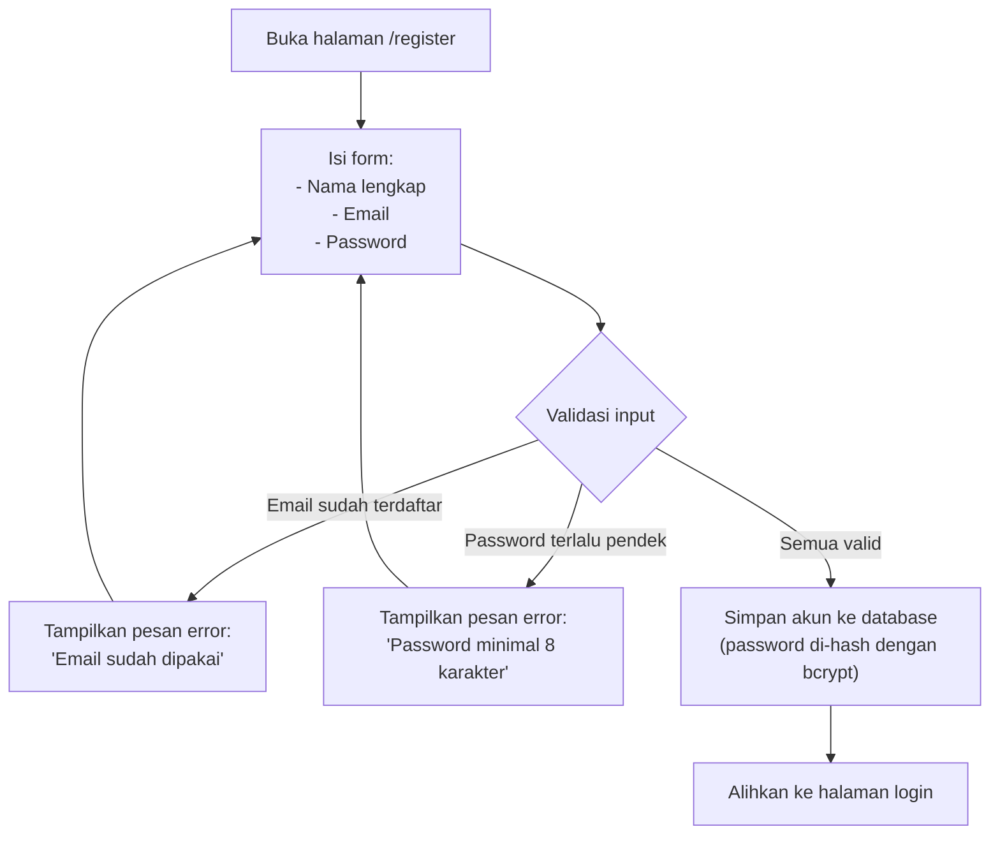

**Langkah-langkah:**

| No | Langkah | Detail |
|---|---|---|
| 1 | Buka halaman registrasi | URL: `/register` |
| 2 | Isi form | Nama lengkap, email, password |
| 3 | Klik "Daftar" | Sistem validasi: email unik, password min 8 karakter |
| 4 | Berhasil | Dialihkan ke halaman login |
| 5 | Gagal | Pesan error ditampilkan, isi ulang |

### Login

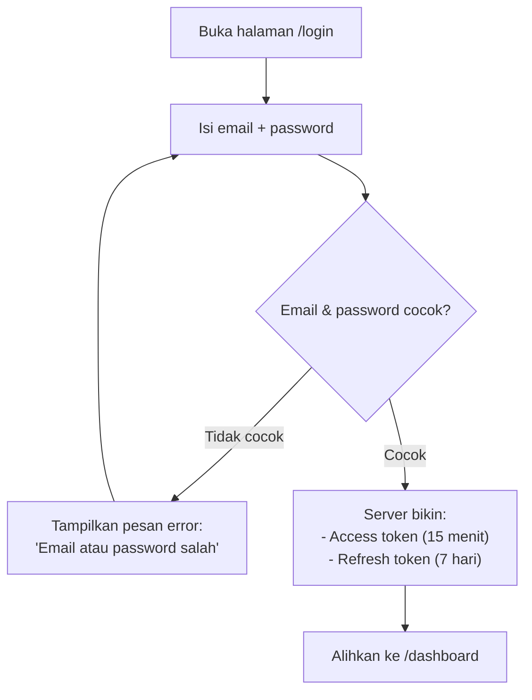

**Langkah-langkah:**

| No | Langkah | Detail |
|---|---|---|
| 1 | Buka halaman login | URL: `/login` |
| 2 | Isi email dan password | — |
| 3 | Klik "Masuk" | Sistem cek kecocokan |
| 4 | Berhasil | Dapat token, masuk dashboard |
| 5 | Gagal 5x dalam 15 menit | Akun dikunci sementara (rate limit) |

### Logout

| No | Langkah | Detail |
|---|---|---|
| 1 | Klik "Keluar" di dashboard | — |
| 2 | Server cabut refresh token | Token lama tidak bisa dipakai lagi |
| 3 | Browser hapus token | Dialihkan ke halaman login |

---

## 2. Alur Guru: Membuat Ujian

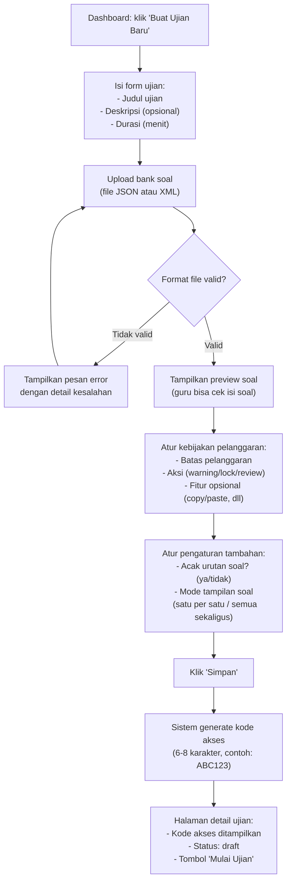

**Langkah-langkah:**

| No | Langkah | Detail |
|---|---|---|
| 1 | Klik "Buat Ujian Baru" | Dari halaman dashboard |
| 2 | Isi informasi ujian | Judul (wajib), deskripsi (opsional), durasi dalam menit (wajib) |
| 3 | Upload bank soal | File JSON atau XML sesuai format yang ditentukan |
| 4 | Sistem validasi file | Kalau format salah → pesan error yang jelas |
| 5 | Preview soal | Guru cek apakah soal ter-parse dengan benar |
| 6 | Atur kebijakan pelanggaran | Berapa kali pelanggaran sebelum ada aksi, aksi apa yang diambil |
| 7 | Atur pengaturan tambahan | Acak soal, mode tampilan soal |
| 8 | Simpan | Kode akses otomatis dibuat, status ujian = "draft" |
| 9 | Bagikan kode akses | Guru bagikan kode ke mahasiswa via chat, papan tulis, dll |

---

## 3. Alur Guru: Mengelola Ujian

### Melihat Daftar Ujian

| No | Langkah | Detail |
|---|---|---|
| 1 | Buka dashboard | Tampil daftar semua ujian milik guru |
| 2 | Filter/tab status | Draft, aktif, selesai, diarsipkan |
| 3 | Klik ujian | Masuk ke halaman detail ujian |

### Status Ujian (Siklus Hidup)

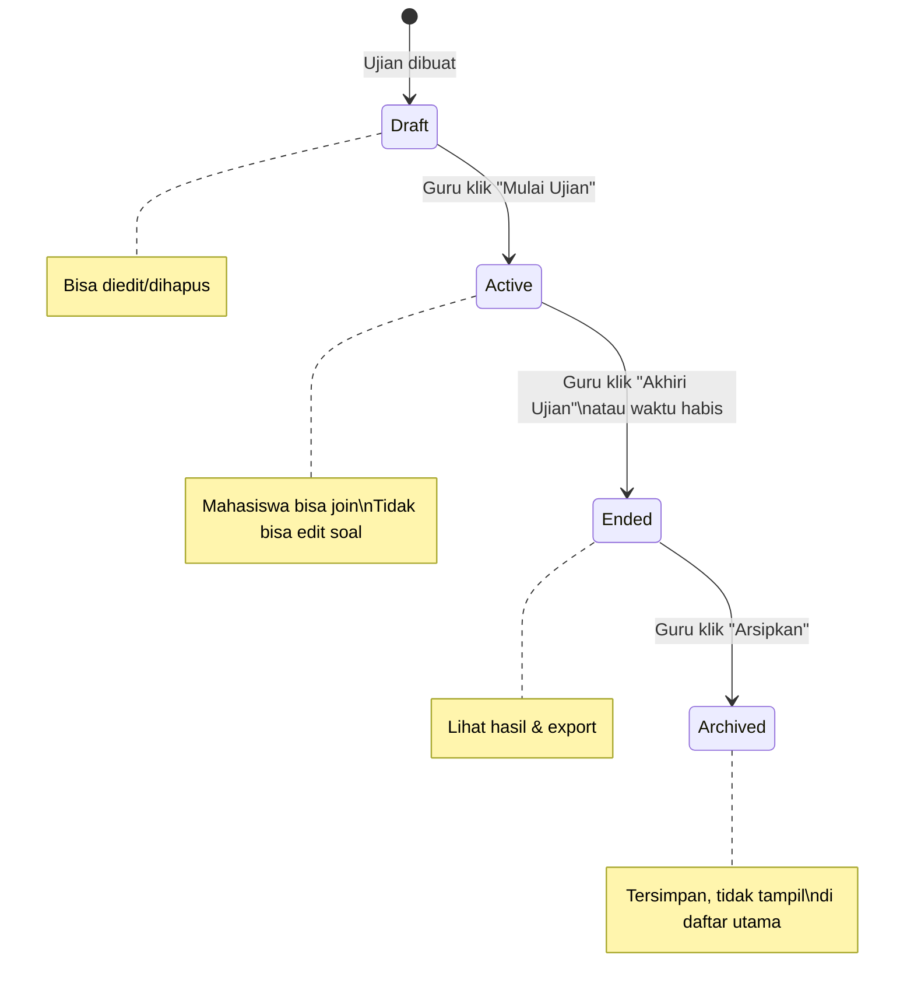

### Edit Ujian

| No | Langkah | Kondisi |
|---|---|---|
| 1 | Buka detail ujian | Status harus "draft" |
| 2 | Ubah informasi | Judul, durasi, soal, kebijakan — semuanya bisa diubah |
| 3 | Simpan | Perubahan tersimpan |

> Kalau ujian sudah "active" (ada peserta), hanya **kebijakan pelanggaran** yang masih bisa diubah. Soal dan durasi tidak bisa diubah.

### Hapus Ujian

| No | Langkah | Detail |
|---|---|---|
| 1 | Klik "Hapus" di detail ujian | Muncul dialog konfirmasi |
| 2 | Konfirmasi hapus | Ujian ditandai "archived" (tidak benar-benar dihapus dari database) |

### Regenerasi Kode Akses

| No | Langkah | Detail |
|---|---|---|
| 1 | Buka detail ujian | — |
| 2 | Klik "Generate Kode Baru" | Kode lama langsung tidak berlaku |
| 3 | Kode baru ditampilkan | Bagikan kode baru ke mahasiswa |

---

## 4. Alur Guru: Monitoring Ujian (Real-time)

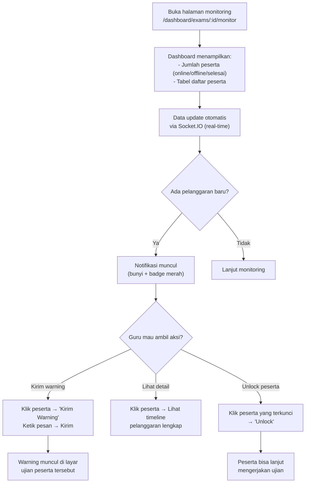

**Apa yang ditampilkan di dashboard:**

| Komponen | Isi |
|---|---|
| **Ringkasan angka** | Total peserta, sedang online, offline, sudah submit, belum submit |
| **Tabel peserta** | Nama, NIM, status (online/offline/selesai), jumlah pelanggaran, aktivitas terakhir |
| **Warna indikator** | 🟢 Hijau = bersih, 🟡 Kuning = sedikit pelanggaran, 🔴 Merah = banyak pelanggaran |
| **Notifikasi** | Muncul otomatis saat ada pelanggaran baru |

**Aksi yang bisa dilakukan guru:**

| Aksi | Cara |
|---|---|
| **Kirim warning** | Klik peserta → tulis pesan → kirim. Pesan muncul sebagai popup di layar ujian peserta |
| **Lihat detail pelanggaran** | Klik peserta → lihat daftar pelanggaran lengkap dengan waktu dan jenis |
| **Unlock peserta** | Klik peserta yang terkunci → tombol "Unlock". Peserta bisa lanjut mengerjakan |

---

## 5. Alur Guru: Melihat Hasil & Export

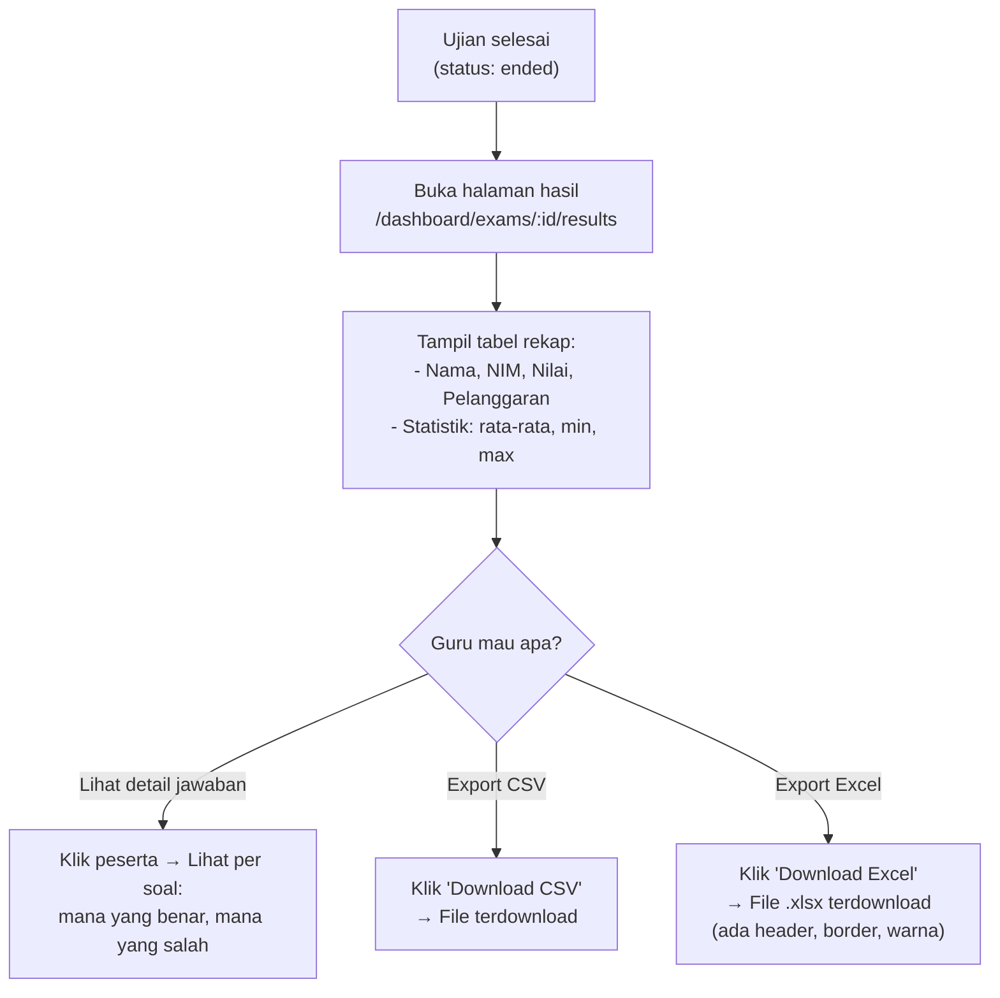

**Langkah-langkah:**

| No | Langkah | Detail |
|---|---|---|
| 1 | Buka halaman hasil ujian | Dari detail ujian yang sudah selesai |
| 2 | Lihat rekap | Tabel semua peserta: nama, NIM, nilai, jumlah pelanggaran |
| 3 | Lihat statistik | Rata-rata nilai, nilai tertinggi, nilai terendah |
| 4 | Lihat detail per peserta | Klik peserta → lihat jawaban per soal (benar/salah) |
| 5 | Export | Pilih format CSV atau Excel → file terdownload |

**Isi file export:**

| Kolom | Contoh |
|---|---|
| Nama | Siti Nurhaliza |
| NIM | 1301210001 |
| Nilai | 85 |
| Jumlah Pelanggaran | 2 |
| Status | Submitted |

---

## 6. Alur Mahasiswa: Join & Mengerjakan Ujian

### Join Ujian

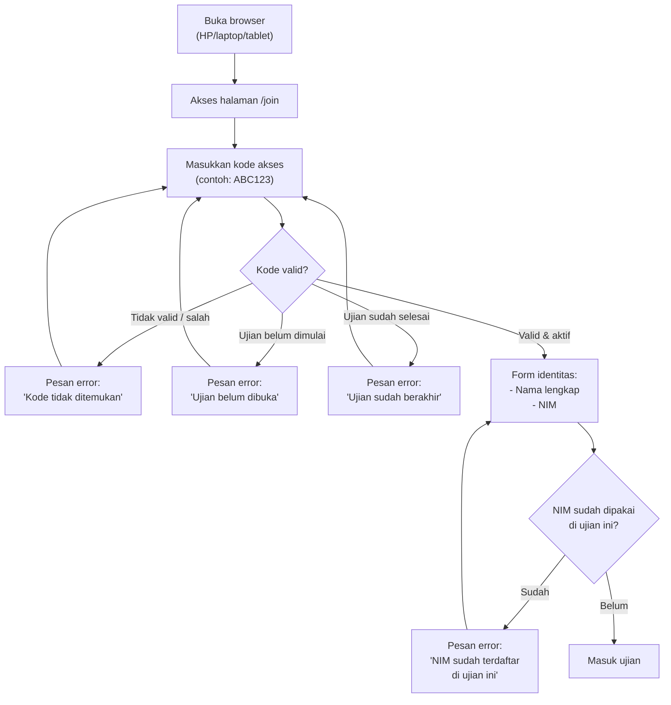

### Mengerjakan Ujian

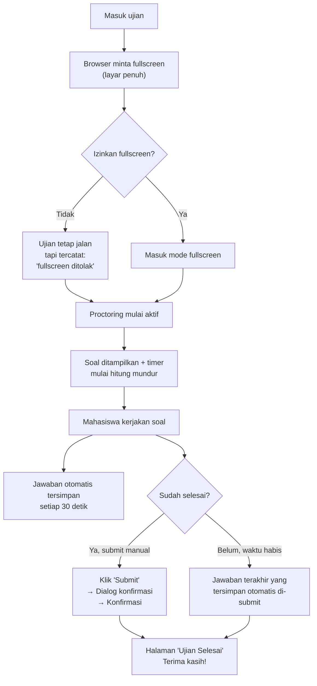

**Langkah-langkah lengkap:**

| No | Langkah | Detail |
|---|---|---|
| 1 | Buka browser | Chrome, Firefox, Safari, Edge — HP atau laptop |
| 2 | Akses halaman join | URL yang diberikan guru |
| 3 | Masukkan kode akses | 6-8 karakter, tidak membedakan huruf besar/kecil |
| 4 | Isi nama dan NIM | NIM harus unik per ujian (tidak bisa join dua kali) |
| 5 | Browser minta fullscreen | Boleh ditolak, tapi tercatat |
| 6 | Proctoring aktif | Sistem mulai memantau aktivitas browser |
| 7 | Kerjakan soal | Soal tampil satu per satu atau sekaligus (tergantung pengaturan guru) |
| 8 | Timer hitung mundur | Waktu dihitung dari server, bukan dari browser. Peringatan muncul saat sisa waktu < 5 menit |
| 9 | Jawaban tersimpan otomatis | Setiap 30 detik, jawaban dikirim ke server |
| 10 | Submit | Manual (klik tombol) atau otomatis (waktu habis) |
| 11 | Halaman selesai | Konfirmasi bahwa jawaban sudah diterima |

---

## 7. Alur Proctoring (Sistem)

> Ini alur di belakang layar — tidak terlihat langsung oleh pengguna.

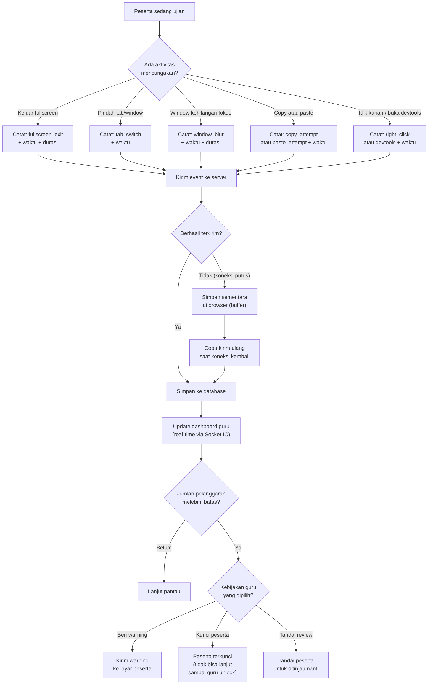

**Jenis event yang dicatat:**

| Event | Kapan Terjadi | Apa yang Dicatat |
|---|---|---|
| `fullscreen_exit` | Peserta keluar dari mode layar penuh | Waktu keluar, berapa lama di luar fullscreen |
| `window_blur` | Jendela browser kehilangan fokus | Waktu blur, berapa lama |
| `tab_switch` | Peserta pindah tab atau buka jendela lain | Waktu pindah |
| `copy_attempt` | Peserta mencoba menyalin teks | Waktu |
| `paste_attempt` | Peserta mencoba menempel teks | Waktu |
| `right_click` | Peserta klik kanan di halaman ujian | Waktu |
| `devtools` | Peserta membuka alat pengembang browser | Waktu |
| `reconnect` | Peserta yang terputus tersambung kembali | Waktu, durasi terputus |
| `heartbeat_lost` | Server tidak menerima sinyal dari peserta > 30 detik | Waktu terakhir sinyal diterima |

---

## 8. Alur Heartbeat & Reconnect (Sistem)

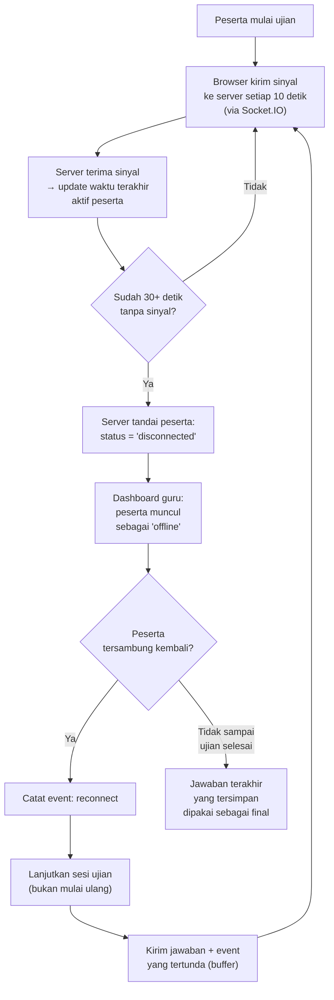

**Ringkasan:**

| Situasi | Yang Terjadi |
|---|---|
| Koneksi normal | Sinyal dikirim tiap 10 detik, status "online" |
| Koneksi putus < 30 detik | Masih dianggap online |
| Koneksi putus > 30 detik | Ditandai "offline/disconnected" di dashboard guru |
| Koneksi kembali | Sesi dilanjutkan, jawaban & event yang tertunda dikirim |
| Koneksi tidak kembali | Jawaban terakhir yang tersimpan otomatis dipakai |

---

## 9. Alur Auto-save & Submit (Sistem)

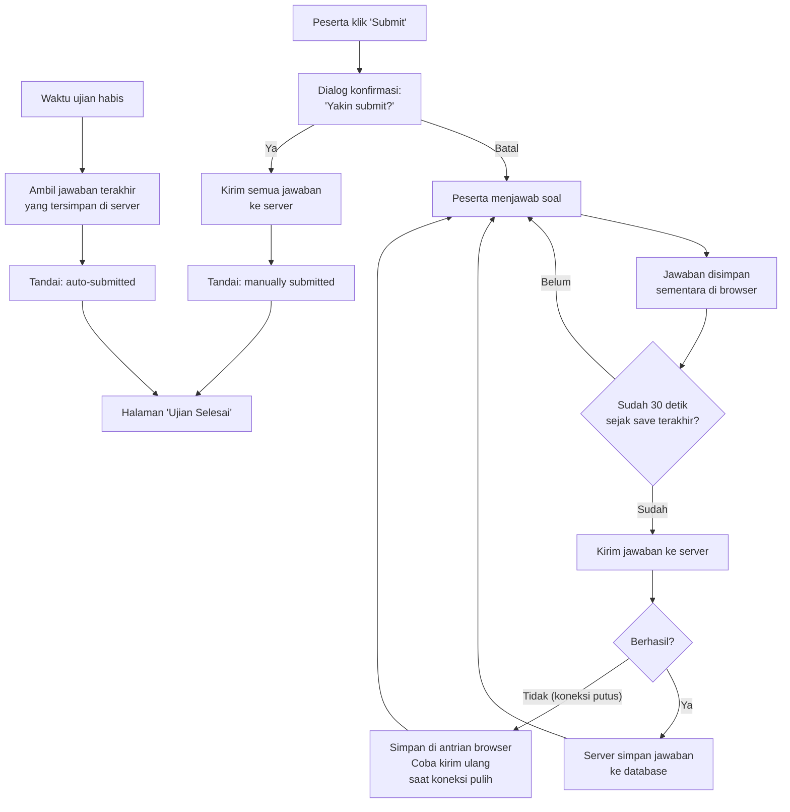

**Aturan penting:**

| Aturan | Detail |
|---|---|
| Auto-save interval | Setiap 30 detik (bisa diatur) |
| Kalau gagal kirim | Jawaban ditampung di browser, dikirim ulang saat koneksi pulih |
| Submit manual | Peserta pilih sendiri kapan submit (sebelum waktu habis) |
| Submit otomatis | Waktu habis → jawaban terakhir yang tersimpan di server langsung di-submit |
| Setelah submit | Jawaban tidak bisa diubah lagi |

---

## Ringkasan Halaman Aplikasi

### Halaman Guru

| Halaman | URL | Fungsi |
|---|---|---|
| Login | `/login` | Masuk ke akun guru |
| Registrasi | `/register` | Buat akun guru baru |
| Dashboard | `/dashboard` | Daftar semua ujian + ringkasan |
| Buat Ujian | `/dashboard/exams/new` | Form buat ujian baru |
| Edit Ujian | `/dashboard/exams/:id/edit` | Form ubah ujian |
| Detail Ujian | `/dashboard/exams/:id` | Info ujian + kode akses |
| Monitoring | `/dashboard/exams/:id/monitor` | Pantau ujian real-time |
| Detail Pelanggaran | `/dashboard/exams/:id/violations/:sid` | Riwayat pelanggaran per peserta |
| Hasil Ujian | `/dashboard/exams/:id/results` | Rekap nilai + export |
| Detail Jawaban | `/dashboard/exams/:id/results/:sid` | Jawaban per peserta |

### Halaman Mahasiswa

| Halaman | URL | Fungsi |
|---|---|---|
| Join Ujian | `/join` | Masukkan kode akses |
| Identitas | `/join/identity` | Isi nama dan NIM |
| Waiting Room | `/exam/waiting` | Tunggu ujian dimulai |
| Ujian | `/exam/session` | Kerjakan soal + timer |
| Selesai | `/exam/done` | Konfirmasi submit berhasil |

---

*Dokumen ini dibuat pada 25 September 2026*
